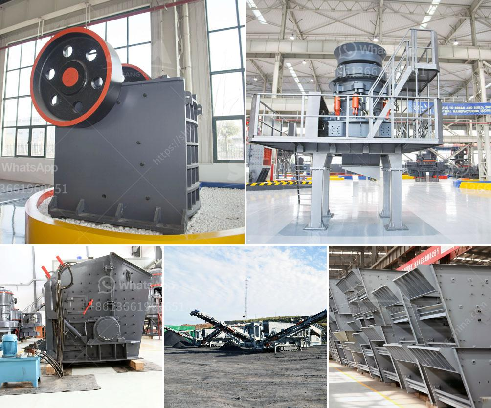

<h3>vertical impact crusher</h3>
The vertical impact crusher, also known as sand making machine and rubble shaping machine, is a type of crusher that has been extensively used for processing materials such as aggregates, sand, ceramics, minerals, coal, and chemicals. In recent years, it has become indispensable in the mining, construction, metallurgy, and chemical industries due to its ability to provide high-quality product outputs.

One of the key features of the vertical impact crusher is its versatility. It can be used for both primary and secondary crushing operations and can easily process materials with a feed size of up to 60 mm. This makes it suitable for a wide range of applications, whether it is a small-scale sand production line or a large-scale mining operation.

The design of the vertical impact crusher ensures that the material is crushed and shaped to the desired particle size in a single pass. This is accomplished through the high-speed rotational motion of the rotor, which throws the materials against the anvils or impact plates located at the top and bottom of the crusher chamber. The impact force generated by the rotor shatters the material into smaller pieces, while the centrifugal force propels the crushed particles outward, ensuring a uniform product size distribution.

Another advantage of the vertical impact crusher is its low operating and maintenance costs. The rotor and wear parts are easily replaceable, and the crusher's durable construction ensures a long service life. Additionally, the vertical impact crusher consumes less energy compared to other crushers, making it an environmentally friendly choice. This is especially important in today's world where sustainability is a top priority for many industries.

The vertical impact crusher also offers excellent particle shape characteristics, producing well-graded and cubical-shaped particles. This is achieved through the unique crushing chamber design, which allows for maximum crushing efficiency while minimizing the production of unwanted fines. The consistent particle shape and size distribution ensure better workability and higher compressive strength of the final product, making it ideal for use in concrete, asphalt, and other construction applications.

Furthermore, the vertical impact crusher offers excellent control over the product gradation. By adjusting the rotor speed, the operator can easily control the size of the final product and tailor it to specific requirements. This versatility allows for greater flexibility in producing different types of aggregates and sands, catering to the demands of various construction projects.

In conclusion, the vertical impact crusher is a powerful and versatile crushing machine that provides high-quality product outputs for a wide range of applications. Its ability to process a variety of materials, low operating and maintenance costs, excellent particle shape characteristics, and easy control over product gradation make it an indispensable tool in the mining, construction, metallurgy, and chemical industries. Whether it is producing aggregates for concrete or shaping sand for manufacturing, the vertical impact crusher is a reliable and efficient choice for any crushing operation.
<h3>Contact us</h3><ul><li><strong>Whatsapp:&nbsp;<a href="https://wa.me/8613661969651">+8613661969651</a></strong></li><li><a href="https://swt.shibang-china.com/?git&amp;zhl&amp;vertical impact crusher"><strong>Online Service(chat now)</strong></a></li></ul><h3>Related</h3><ul><li><a href='canber de broage ciment.md'>canber de broage ciment</a></li><li><a href='aggregate crushing plant price.md'>aggregate crushing plant price</a></li><li><a href='barite ore processing in morocco.md'>barite ore processing in morocco</a></li><li><a href='used washing gold plants for sale in europe.md'>used washing gold plants for sale in europe</a></li><li><a href='grinding equipment and machinery.md'>grinding equipment and machinery</a></li></ul>