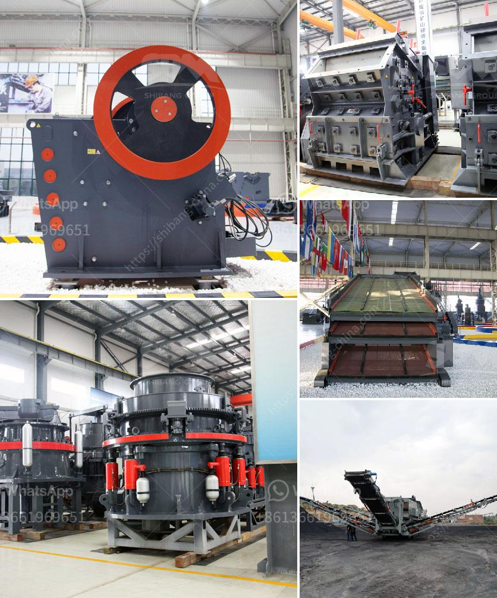

<h3>vertical mill for calcite</h3>
A vertical mill is a specialized equipment designed to efficiently grind materials like calcite into fine powder. In the mining industry, calcite is commonly found in limestone and marble deposits, making it an optimal material for construction, agricultural, and pharmaceutical industries. With the increasing demand for calcite, the vertical mill proves to be an effective tool for processing this mineral.

The vertical mill for calcite is equipped with various mechanical components that enable it to produce the desired product size. The dynamic and static separator in the mill efficiently separates the coarse and fine particles to meet the required fineness. Additionally, the grinding rollers and grinding rings in the vertical mill apply constant pressure on the material, ensuring an efficient grinding process.

The vertical mill’s design allows for a compact footprint, ensuring space-saving installation. Its vertical layout also helps in minimizing energy consumption, as the material flows directly downwards under gravity, reducing the need for additional power. Moreover, the vertical mill operates at a low noise level, allowing for a pleasant working environment.

One of the significant advantages of using a vertical mill for calcite grinding is its ability to produce a uniform particle size distribution, eliminating the need for additional sieving or classification equipment. This ensures that the end product meets the desired specifications, leading to reduced waste and cost-effective production.

Furthermore, the vertical mill for calcite offers flexibility in its operation. The speed of the grinding table can be adjusted to suit different grinding requirements, providing the ability to control the fineness of the final product. This adaptability makes the vertical mill suitable for processing calcite of various grades, making it a versatile tool for different applications.

In conclusion, the vertical mill is a reliable and efficient equipment for grinding calcite in various industries. Its compact design, low energy consumption, and ability to produce a uniform particle size distribution make it a preferred choice for manufacturers. With its flexibility and reliability, the vertical mill proves to be a valuable asset in the processing of calcite, contributing to increased productivity and reduced costs.
<h3>Contact us</h3><ul><li><strong>Whatsapp:&nbsp;<a href="https://wa.me/8613661969651">+8613661969651</a></strong></li><li><a href="https://swt.shibang-china.com/?git&amp;zhl&amp;vertical mill for calcite"><strong>Online Service(chat now)</strong></a></li></ul><h3>Related</h3><ul><li><a href='mines de cobalt de cuivre de la zambie.md'>mines de cobalt de cuivre de la zambie</a></li><li><a href='ball mills for mining price.md'>ball mills for mining price</a></li><li><a href='with conveyor price philippines.md'>with conveyor price philippines</a></li><li><a href='gold hammer mill used forr sale in zimbabwe.md'>gold hammer mill used forr sale in zimbabwe</a></li><li><a href='crushing hpc cone crusher.md'>crushing hpc cone crusher</a></li></ul>