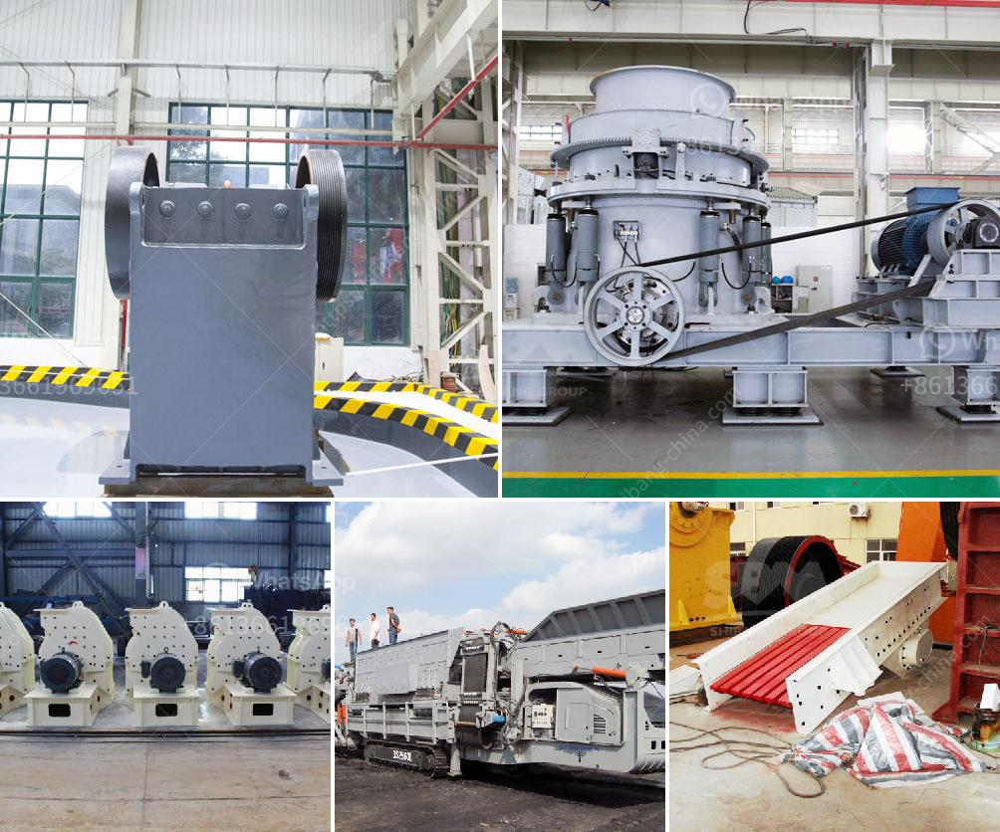

<h3>vertical mill for slag grinding</h3>
Slag, as the byproduct of steel production, has always been considered a waste. But with the rapid development of steel industry, it is now utilized in various ways. With the increasing demand for high-quality steel, the need for efficient slag grinding is more pronounced than ever. This is where the vertical mill, also known as the vertical roller mill, comes in.

Traditionally, the slag grinding process was carried out in a ball mill, which consumes a lot of energy, slows down the process, and results in high labor intensity. However, the emergence of vertical mills has completely changed the landscape of slag grinding. The vertical mill is a highly efficient and energy-saving grinding equipment that integrates crushing, grinding, drying, and grading of materials. It revolutionizes the way slag is ground and enables steel mills to improve their production efficiency.

One of the key advantages of the vertical mill for slag grinding is its ability to grind materials with high water content, such as slag. This is due to the fact that the vertical mill combines crushing, grinding, drying, and grading functions into one compact unit. This means that the material can be dried while being ground, eliminating the need for additional drying equipment. As a result, the vertical mill reduces the energy consumption and production costs associated with slag grinding.

Another advantage of the vertical mill is its low noise level and small vibration. Unlike traditional ball mills, which tend to produce a considerable amount of noise and vibration during operation, the vertical mill operates seamlessly and quietly. This creates a more comfortable and safe working environment for operators.

Furthermore, the vertical mill can produce high-quality slag powder with a narrow particle size distribution. This is crucial for steel mills, as the quality of slag powder directly affects the performance of cement and concrete. With the vertical mill, steel mills can produce slag powder with finer particles, which enhances the cement strength and reduces the risk of cracking.

In terms of maintenance, the vertical mill is also simpler and easier to operate compared to the ball mill. It requires less manpower, reduces downtime, and has a longer service life. This allows steel mills to save on maintenance costs and improve overall productivity.

In conclusion, the vertical mill for slag grinding is a revolutionary solution that provides steel mills with a more efficient and cost-effective way to grind slag. It combines crushing, grinding, drying, and grading functions into one compact unit, saving energy and reducing production costs. Its low noise level, small vibration, and ability to produce high-quality slag powder make it a preferred choice for steel mills worldwide. With the vertical mill, steel mills can increase their production efficiency, improve cement quality, and ultimately achieve sustainable development.
<h3>Contact us</h3><ul><li><strong>Whatsapp:&nbsp;<a href="https://wa.me/8613661969651">+8613661969651</a></strong></li><li><a href="https://swt.shibang-china.com/?git&amp;zhl&amp;vertical mill for slag grinding"><strong>Online Service(chat now)</strong></a></li></ul><h3>Related</h3><ul><li><a href='second hand stone crushing plants india.md'>second hand stone crushing plants india</a></li><li><a href='vertical impact crusher.md'>vertical impact crusher</a></li><li><a href='washing machines detailed diagrams.md'>washing machines detailed diagrams</a></li><li><a href='how does a jaw crusher limestone.md'>how does a jaw crusher limestone</a></li><li><a href='aggregate washing machine saudi arabia.md'>aggregate washing machine saudi arabia</a></li></ul>