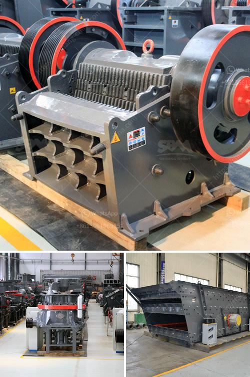

<h3>vertical roller mill for cement grinding</h3>
Vertical roller mill has become the preferred equipment for raw material and coal grinding in cement plants. It is capable of handling higher capacities, better particle size distribution, and can provide reliable operation with minimal maintenance effort.

The grinding process in a vertical roller mill is achieved by compressing the material between the grinding table and the rollers. The material is ground by multiple rollers, which are pressed firmly against the grinding table. This pressure can be adjusted to control the grinding efficiency and product fineness.

One of the key advantages of the vertical roller mill is its high energy efficiency. It can produce cement with lower energy consumption compared to traditional cement grinding technologies, such as ball mills. Furthermore, the roller press can be used as a pre-grinding system in combination with a ball mill or other grinding equipment to achieve maximum efficiency.

Vertical roller mills are also capable of drying materials, reducing the moisture content of the raw materials before they are fed into the grinding mill. This can improve the overall performance of the cement plant, saving energy and reducing costs.

In addition to its efficiency and drying capabilities, the vertical roller mill also offers other benefits. It has a smaller footprint compared to traditional grinding mills, allowing for more efficient use of space in the cement plant. It is also easier to maintain and operate, with fewer moving parts and less maintenance required.

Overall, the vertical roller mill is an excellent choice for cement grinding. It provides higher grinding efficiency, reduces energy consumption, and offers other benefits such as smaller footprint and easier maintenance. With the continuous advancements in vertical roller mill technology, this equipment is expected to play an even more significant role in the cement industry in the future.
<h3>Contact us</h3><ul><li><strong>Whatsapp:&nbsp;<a href="https://wa.me/8613661969651">+8613661969651</a></strong></li><li><a href="https://swt.shibang-china.com/?git&amp;zhl&amp;vertical roller mill for cement grinding"><strong>Online Service(chat now)</strong></a></li></ul><h3>Related</h3><ul><li><a href='uses jaw crusher in kenya.md'>uses jaw crusher in kenya</a></li><li><a href='jaw crusher manufacturers.md'>jaw crusher manufacturers</a></li><li><a href='crushing machine in ghana.md'>crushing machine in ghana</a></li><li><a href='stone crusher capacity.md'>stone crusher capacity</a></li><li><a href='crusher plant supplier.md'>crusher plant supplier</a></li></ul>