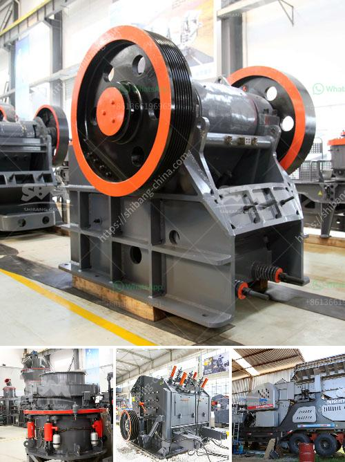

<h3>vertical roller mill maintenance pdf</h3>
The vertical roller mill (VRM) is a type of grinding machine for raw material processing and cement grinding in the cement manufacturing industry. In the recent years, the VRM has become a popular choice for raw material grinding due to its higher grinding efficiency and lower power consumption compared to other traditional grinding mills.

Like any other grinding equipment, the VRM requires regular maintenance to ensure its optimal operation and prolong its lifespan. This article discusses the maintenance guidelines for a VRM based on the manufacturer's recommendations and industry best practices.

Lubrication is essential for the smooth operation of the VRM. All lubrication points should be regularly inspected and lubricated. This includes the roller bearings, gearboxes, and other moving parts. The lubrication system should be flushed regularly to remove any contaminants and ensure the quality of the lubricating oil.

The wear parts of the VRM, such as grinding rollers and grinding table liners, should be inspected regularly for signs of wear and tear. If any excessive wear is observed, the worn parts should be replaced promptly to maintain the grinding efficiency and prevent any damages to other components.

Proper cleaning of the VRM is crucial to prevent the build-up of material residues and ensure its smooth operation. Regularly clean the interior of the mill, including the grinding chamber, rollers, and air ducts, to remove any dust, debris, or material build-up.

Periodically check the alignment of the grinding rollers and ensure they are parallel to the grinding table. Improper alignment can result in uneven wear and reduced grinding efficiency. The tension of the grinding rollers should also be adjusted according to the manufacturer's recommendations to maintain the proper grinding pressure.

Regular inspections of the VRM components are necessary to identify any potential issues or abnormalities. This includes checking the condition of seals, belts, bolts, and electrical connections. Any worn-out or damaged components should be repaired or replaced as soon as possible to avoid any unexpected breakdowns.

Providing proper training to the maintenance personnel is crucial to ensure the correct maintenance procedures are followed. Additionally, maintaining comprehensive documentation of all maintenance activities, including inspection reports, repairs, and replacements, can provide valuable data for future reference and analysis.

In conclusion, regular maintenance is essential to ensure the reliable and efficient operation of a vertical roller mill. Proper lubrication, inspection of wear parts, cleaning, alignment, and regular inspections are some of the key maintenance activities that should be carried out to maximize the mill's performance and lifespan. By following these maintenance guidelines, operators can minimize downtime, reduce maintenance costs, and optimize the overall productivity of the VRM.
<h3>Contact us</h3><ul><li><strong>Whatsapp:&nbsp;<a href="https://wa.me/8613661969651">+8613661969651</a></strong></li><li><a href="https://swt.shibang-china.com/?git&amp;zhl&amp;vertical roller mill maintenance pdf"><strong>Online Service(chat now)</strong></a></li></ul><h3>Related</h3><ul><li><a href='stone grinding mill.md'>stone grinding mill</a></li><li><a href='stone quarries south africa.md'>stone quarries south africa</a></li><li><a href='gold wash plant irs california.md'>gold wash plant irs california</a></li><li><a href='crushing machine south africa.md'>crushing machine south africa</a></li><li><a href='superfine grinding mills in shanhgai.md'>superfine grinding mills in shanhgai</a></li></ul>