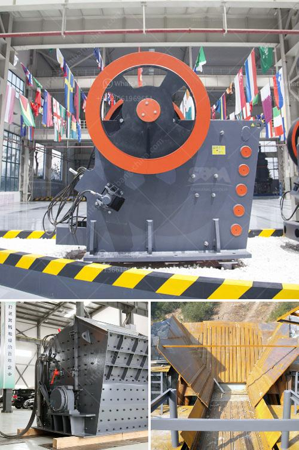

<h3>vertical roller mill manufacturers</h3>
Vertical roller mill (VRM) is a type of industrial equipment used to crush or grind materials into small particles. Due to its high efficiency and energy-saving characteristics, it has become the preferred equipment for crushing and grinding raw materials in the cement industry.

There are several renowned vertical roller mill manufacturers in the industry, each offering their unique products and services. These manufacturers adhere to strict quality standards and provide reliable and durable equipment for various applications.

One such manufacturer is ABC Machinery, a leading supplier of vertical roller mills. With years of experience in designing and manufacturing, ABC Machinery has emerged as a trusted name in the industry. Their vertical roller mills are known for their excellent performance and high productivity. The company has a team of skilled engineers who continuously innovate and improve the design to meet the changing market demands.

Another prominent manufacturer in the market is XYZ Corporation. They offer a wide range of vertical roller mills that are designed to handle various materials, including limestone, coal, and ores. Their mills are known for their rugged construction and low maintenance requirements. XYZ Corporation has a strong commitment to customer satisfaction and offers comprehensive after-sales support to ensure the smooth operation of the equipment.

Apart from these, there are several other vertical roller mill manufacturers like LMV Industries, QRS Mills, and RST Engineering, who have established their reputation in the market. These manufacturers boast state-of-the-art manufacturing facilities and a team of skilled professionals who ensure the highest quality standards are maintained.

In conclusion, vertical roller mill manufacturers play a pivotal role in the cement industry by providing reliable and efficient equipment. Their continuous innovation and dedication to quality ensure that the mills meet the specific requirements of customers. Whether it is crushing limestone or grinding coal, these manufacturers offer a wide range of mills suitable for various applications.
<h3>Contact us</h3><ul><li><strong>Whatsapp:&nbsp;<a href="https://wa.me/8613661969651">+8613661969651</a></strong></li><li><a href="https://swt.shibang-china.com/?git&amp;zhl&amp;vertical roller mill manufacturers"><strong>Online Service(chat now)</strong></a></li></ul><h3>Related</h3><ul><li><a href='mobile crusher in the coal mining.md'>mobile crusher in the coal mining</a></li><li><a href='vibratory screen design.md'>vibratory screen design</a></li><li><a href='mobile gold refinery for sale.md'>mobile gold refinery for sale</a></li><li><a href='quick lime powder machine.md'>quick lime powder machine</a></li><li><a href='sand wash plants for sale in texas.md'>sand wash plants for sale in texas</a></li></ul>