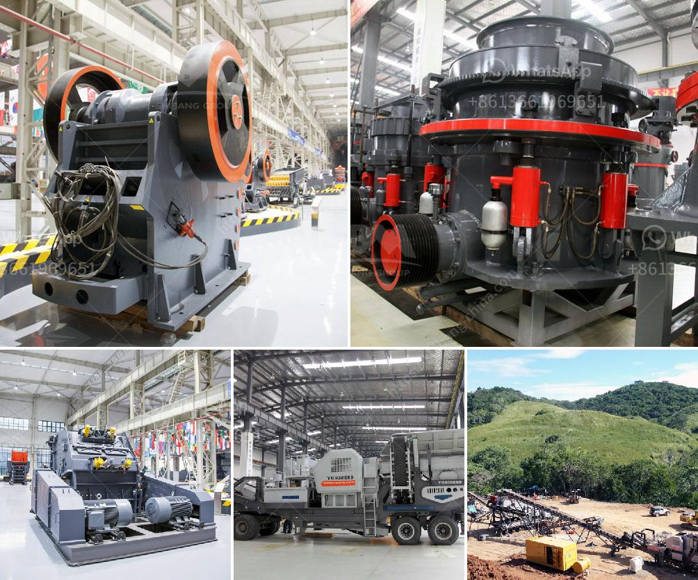

<h3>vibrating classifiing screen</h3>
Vibrating classifying screens are widely used in various industries for the purpose of separating materials based on their size. This equipment plays a crucial role in ensuring efficient and accurate screening, making it an essential tool for many businesses. In this article, we will explore the features, benefits, and applications of a vibrating classifying screen.

A vibrating classifying screen consists of a frame, a screen surface, a vibration generator, a vibration damping spring, and a motor. The frame provides a solid structure to hold the screen surface in place, while the vibration generator generates high-frequency vibrations to facilitate the screening process. The vibration damping spring helps to reduce excessive vibrations and ensures stability, while the motor provides the power needed to operate the equipment.

One of the key benefits of a vibrating classifying screen is its ability to accurately separate materials based on their size. The screen surface consists of multiple layers of mesh, which allows for precise classification of different particle sizes. This is particularly important in industries such as mining, construction, and agriculture, where materials need to be carefully classified for further processing or disposal.

The vibrating motion of the screen surface helps to facilitate the separation process. As the material is fed onto the screen, the vibrations cause the particles to move and stratify according to their size. The larger particles stay on the top layer, while the smaller ones pass through the mesh and are collected separately. This mechanism ensures that materials are classified correctly, improving overall operational efficiency.

Another advantage of vibrating classifying screens is their high throughput capacity. These screens can handle large volumes of materials, making them suitable for industries that require continuous processing. The vibrating motion helps to keep the screen surface clean, preventing clogging and ensuring consistent screening performance. The high throughput capacity combined with accurate classification makes vibrating classifying screens an ideal choice for many industrial applications.

The applications of vibrating classifying screens are diverse and widespread. In mining operations, these screens are commonly used to separate different types of ores, minerals, and coal. In the construction industry, they are used to classify aggregates, such as sand, gravel, and crushed stones. Vibrating classifying screens are also used in the recycling industry to separate and sort various types of waste materials. The versatility of these screens makes them indispensable in many industries.

In conclusion, vibrating classifying screens are an essential tool in various industries due to their ability to accurately separate materials based on their size. With features such as precise classification, high throughput capacity, and versatile applications, these screens significantly improve operational efficiency. Whether it is mining, construction, or recycling, vibrating classifying screens play a crucial role in ensuring optimal screening performance. As technology advances, we can expect further innovations in vibrating classifying screens, leading to even more efficient and productive screening processes.
<h3>Contact us</h3><ul><li><strong>Whatsapp:&nbsp;<a href="https://wa.me/8613661969651">+8613661969651</a></strong></li><li><a href="https://swt.shibang-china.com/?git&amp;zhl&amp;vibrating classifiing screen"><strong>Online Service(chat now)</strong></a></li></ul><h3>Related</h3><ul><li><a href='impact crusher china.md'>impact crusher china</a></li><li><a href='output size of stone crusher machine.md'>output size of stone crusher machine</a></li><li><a href='coal wash plant indonesia.md'>coal wash plant indonesia</a></li><li><a href='mica crusher production plants.md'>mica crusher production plants</a></li><li><a href='crushing and screening plant rental.md'>crushing and screening plant rental</a></li></ul>