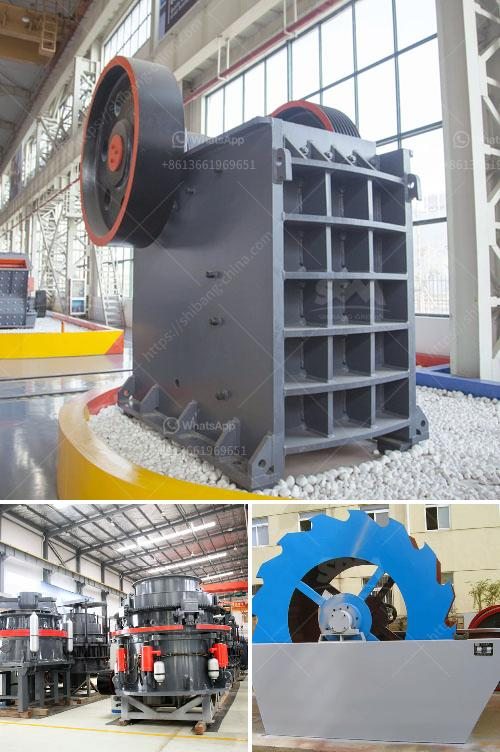

<h3>vibrating feeder for heavy quarry use</h3>
A vibrating feeder for heavy quarry use is an essential component in the production line of a quarry. The purpose of the feeder is to evenly and efficiently feed large and coarse materials into the primary crusher, ensuring an uninterrupted flow of material to produce high-quality end products.

A vibrating feeder operates by vibrating the tray or deck, where the materials are placed, causing them to move along a predetermined path. This controlled movement ensures that the materials are effectively distributed across the width of the tray, preventing irregular feeding and clogging.

In heavy quarrying environments, the vibrating feeder needs to be robust and durable, capable of withstanding the harsh conditions of the quarry site. These feeders are typically made from heavy-duty steel or cast iron, ensuring that they can endure the constant impact and stress from the heavy rocks and materials being fed.

One of the key advantages of using a vibrating feeder for heavy quarry use is its ability to handle large capacities. These feeders can handle a range of material sizes, from boulders to gravel, and have the capacity to process thousands of tons of material per hour. This efficient feeding capability allows quarries to maximize their production and meet high demand.

Additionally, vibrating feeders for heavy quarry use are designed with safety in mind. They incorporate features to prevent overloading, such as overload protection devices or sensors. These safety mechanisms ensure that the feeder does not get overwhelmed by excessive loads, reducing the risk of equipment failure and potential accidents.

The design of a vibrating feeder also plays a crucial role in optimizing its performance for heavy quarry use. It should be able to handle various types of materials, including wet and sticky materials. Some feeders come equipped with special liners or coatings that resist abrasion and minimize material buildup, further improving their reliability in challenging quarrying operations.

In terms of maintenance, a vibrating feeder for heavy quarry use requires regular inspections and proper care. This includes checking for signs of wear and tear, lubricating moving parts, and cleaning any accumulated debris or material. Any necessary repairs or replacements should be carried out promptly to ensure uninterrupted operation.

Modern vibrating feeders for heavy quarry use often incorporate advanced technologies that enhance their efficiency and convenience. For instance, some feeders are equipped with remote monitoring systems, allowing operators to monitor and control the feeder remotely. This remote functionality enables quick troubleshooting, reduces downtime, and improves overall productivity.

In conclusion, a vibrating feeder for heavy quarry use is a critical component in the quarry production line. Its ability to handle large capacities of materials and efficiently feed them to the primary crusher ensures uninterrupted and optimized operation. These feeders are designed to withstand the rigors of quarrying environments and are equipped with safety features to prevent overloading. Regular maintenance and the use of advanced technologies further enhance their performance and reliability.
<h3>Contact us</h3><ul><li><strong>Whatsapp:&nbsp;<a href="https://wa.me/8613661969651">+8613661969651</a></strong></li><li><a href="https://swt.shibang-china.com/?git&amp;zhl&amp;vibrating feeder for heavy quarry use"><strong>Online Service(chat now)</strong></a></li></ul><h3>Related</h3><ul><li><a href='bentonite plant dimensions.md'>bentonite plant dimensions</a></li><li><a href='mobile stone crushers south africa.md'>mobile stone crushers south africa</a></li><li><a href='small mobile limestone crushers.md'>small mobile limestone crushers</a></li><li><a href='ethiopia conveyor belt india.md'>ethiopia conveyor belt india</a></li><li><a href='coal pulverizer machine hammer.md'>coal pulverizer machine hammer</a></li></ul>