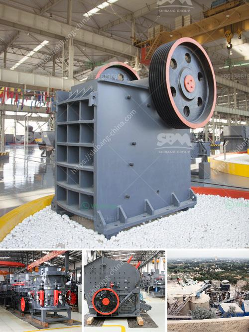

<h3>vibrating machine for concrete</h3>
When it comes to concrete construction projects, ensuring that the concrete is properly compacted is crucial for the overall strength and durability of the structure. This is where vibrating machines for concrete play a vital role. These machines are designed to effectively consolidate the concrete before it sets, eliminating air pockets and ensuring maximum density.

The vibrating machine for concrete consists of a motor and an eccentric weight system. This setup generates vibrations that are transferred to the concrete through a base plate or a vibrating needle. The vibrations evenly distribute throughout the concrete, helping it settle uniformly and removing any voids or air bubbles trapped within.

One of the primary benefits of using a vibrating machine for concrete is improved efficiency. By eliminating air pockets and improving the consolidation process, the machine helps achieve a denser and more uniform concrete mix. This, in turn, enhances the strength and durability of the structure.

Moreover, the use of a vibrating machine for concrete saves time and effort. The vibrations facilitate the flow of concrete in hard-to-reach areas, ensuring comprehensive coverage without the need for excessive manual intervention. It also eliminates the need for manual tamping or hammering, speeding up the construction process.

Additionally, using a vibrating machine for concrete significantly enhances the quality of the finished product. By eliminating air voids and ensuring proper compaction, it minimizes the risk of potential cracks or structural issues in the long run. The improved density also enhances the concrete's resistance to wear, abrasion, and impacts, prolonging its lifespan.

It is important to note that when using a vibrating machine for concrete, operators should maintain proper safety precautions. This includes wearing protective gear, ensuring a stable and secure working environment, and following manufacturer guidelines for operation.

In conclusion, vibrating machines for concrete offer a range of benefits to construction projects. From improving efficiency and saving time to enhancing the quality and durability of concrete structures, these machines are indispensable in the industry. By investing in these tools, contractors can achieve superior results and ensure long-lasting, reliable construction projects.
<h3>Contact us</h3><ul><li><strong>Whatsapp:&nbsp;<a href="https://wa.me/8613661969651">+8613661969651</a></strong></li><li><a href="https://swt.shibang-china.com/?git&amp;zhl&amp;vibrating machine for concrete"><strong>Online Service(chat now)</strong></a></li></ul><h3>Related</h3><ul><li><a href='listing price tons per hour screw conveyor.md'>listing price tons per hour screw conveyor</a></li><li><a href='300tph ball mill manufacturer in philippines.md'>300tph ball mill manufacturer in philippines</a></li><li><a href='russia stone crusher.md'>russia stone crusher</a></li><li><a href='crusher unit and quarry land for sale.md'>crusher unit and quarry land for sale</a></li><li><a href='pulverizing ball mills suppliers.md'>pulverizing ball mills suppliers</a></li></ul>