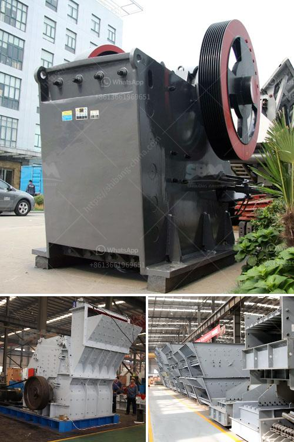

<h3>vibrating screen analysis</h3>
In various industries, the vibrating screen is an essential piece of equipment that is used to separate and classify materials into different sizes. From mining and construction to pharmaceuticals and food processing, vibrating screens are utilized in a wide range of applications.

But what exactly is vibrating screen analysis and why is it crucial for businesses? Let's delve into the topic and understand the significance of this process.

Vibrating screen analysis involves evaluating the efficiency, performance, and capacity of the screen. By analyzing various parameters such as particle size distribution, material flow patterns, and screening efficiency, businesses can improve their screening operations and optimize the overall production process.

One of the primary objectives of vibrating screen analysis is to determine the screening efficiency of the screen. This measurement helps in understanding how well the screen is separating the desired materials from the oversize or undersize particles. High screening efficiency ensures maximum output and minimizes wasted resources.

There are several factors that contribute to the screening efficiency of a vibrating screen. Some of these include the inclination angle of the screen deck, vibration frequency and amplitude, screen mesh size, and the moisture content of the material being screened. Analyzing these factors can help optimize the screen to achieve the desired efficiency.

Another crucial aspect of vibrating screen analysis is understanding the particle size distribution. Different industries require varying size fractions of materials to be screened accurately. By analyzing the particle size distribution, businesses can adjust the screen settings to ensure that the desired size fractions are efficiently separated.

Additionally, understanding the material flow pattern on the screen is essential for efficient screening. By analyzing the flow pattern, businesses can identify any blockages or dead zones that hinder the screening process. This analysis helps in optimizing the screen design and improving the overall performance.

Furthermore, vibrating screen analysis helps in identifying potential screen wear issues. Over time, continuous operation of the screen can lead to wear and tear of the screen media and other components. By analyzing the wear patterns, businesses can proactively replace worn-out parts and avoid unexpected downtime and costly repairs.

To perform a vibrating screen analysis, various methods and techniques are available. These include visual inspection, sieve analysis, and the use of advanced technology such as laser diffraction and image analysis. Choosing the appropriate method depends on the specific needs and requirements of the industry.

In conclusion, vibrating screen analysis is a critical process that businesses should undertake to optimize their screening operations. It helps in evaluating the screening efficiency, particle size distribution, material flow patterns, and screen wear issues. By understanding these factors, businesses can improve their overall production process, increase productivity, and reduce costs. Investing in vibrating screen analysis can have significant long-term benefits for industries that rely on efficient screening.
<h3>Contact us</h3><ul><li><strong>Whatsapp:&nbsp;<a href="https://wa.me/8613661969651">+8613661969651</a></strong></li><li><a href="https://swt.shibang-china.com/?git&amp;zhl&amp;vibrating screen analysis"><strong>Online Service(chat now)</strong></a></li></ul><h3>Related</h3><ul><li><a href='dorries vertical grinders used for sale europe.md'>dorries vertical grinders used for sale europe</a></li><li><a href='technology of conveyor belts.md'>technology of conveyor belts</a></li><li><a href='cost of jaw crusher.md'>cost of jaw crusher</a></li><li><a href='the vertical mill ireland information.md'>the vertical mill ireland information</a></li><li><a href='chromite processing plant and separation machine.md'>chromite processing plant and separation machine</a></li></ul>