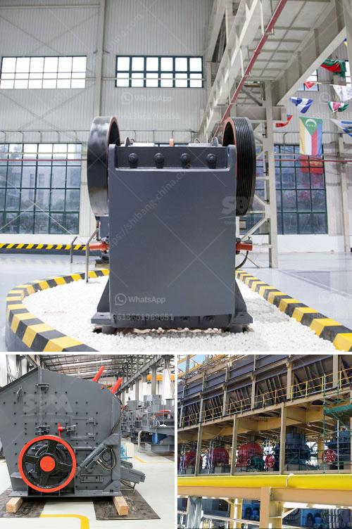

<h3>vibrating screen capacity calculation</h3>
Vibrating screens are widely used in industries for sorting and sizing materials. They provide high efficiency and accuracy in the separation process, making them essential equipment in many processing plants. One crucial aspect of vibrating screens is determining their capacity, as it directly affects the productivity and efficiency of the entire operation.

Calculating vibrating screen capacity involves using available data on the material being sorted and applying a simple formula. While it may initially appear complex, the process can be broken down into manageable steps:

Before performing the capacity calculation, several parameters need to be identified. These include the material's bulk density, particle size distribution, moisture content, and the desired screening efficiency. Gathering accurate data is important to ensure an accurate calculation.

The screen area refers to the effective surface area of the vibrating screen, where the material is separated. It is determined by multiplying the width and length of the screen surface. For example, a screen with a width of 2 meters and a length of 4 meters would have a screen area of 8 square meters.

The screening area coefficient accounts for the percentage of the screen area that is actually available for screening. It takes into consideration factors such as the inclination angle of the screen surface and the presence of any obstructions or openings. The coefficient typically ranges from 0.7 to 1.0, depending on the specific screen design and application.

The effective screening area is calculated by multiplying the screen area by the screening area coefficient. For example, if the screen area is 8 square meters and the screening area coefficient is 0.8, the effective screening area would be 6.4 square meters.

The material feed rate refers to the amount of material that is fed onto the vibrating screen per unit time. It is influenced by factors such as the desired throughput and the characteristics of the material being processed. The feed rate can be measured in terms of mass flow rate (e.g., kilograms per hour) or volumetric flow rate (e.g., cubic meters per hour).

The theoretical screening capacity is determined by dividing the material feed rate by the effective screening area. For example, if the material feed rate is 1000 kg/h and the effective screening area is 6.4 square meters, the theoretical screening capacity would be 156.25 kg/h per square meter.

It's important to note that the theoretical screening capacity does not account for factors that can affect the actual screening performance, such as screen efficiency, material bed depth, and material characteristics. Therefore, it serves as a baseline value and can be adjusted based on practical experience and observations.

In conclusion, calculating vibrating screen capacity is a relatively straightforward process that can be accomplished by following the steps outlined above. By accurately determining the capacity, operators can optimize the performance of their vibrating screens, ensuring efficient and productive material separation.
<h3>Contact us</h3><ul><li><strong>Whatsapp:&nbsp;<a href="https://wa.me/8613661969651">+8613661969651</a></strong></li><li><a href="https://swt.shibang-china.com/?git&amp;zhl&amp;vibrating screen capacity calculation"><strong>Online Service(chat now)</strong></a></li></ul><h3>Related</h3><ul><li><a href='gravity gold recovery mill.md'>gravity gold recovery mill</a></li><li><a href='crushing plant in lahore.md'>crushing plant in lahore</a></li><li><a href='china quarry crushing production line equipment.md'>china quarry crushing production line equipment</a></li><li><a href='river stone crusher plant.md'>river stone crusher plant</a></li><li><a href='cornerstone equipment inc used rock crushers.md'>cornerstone equipment inc used rock crushers</a></li></ul>