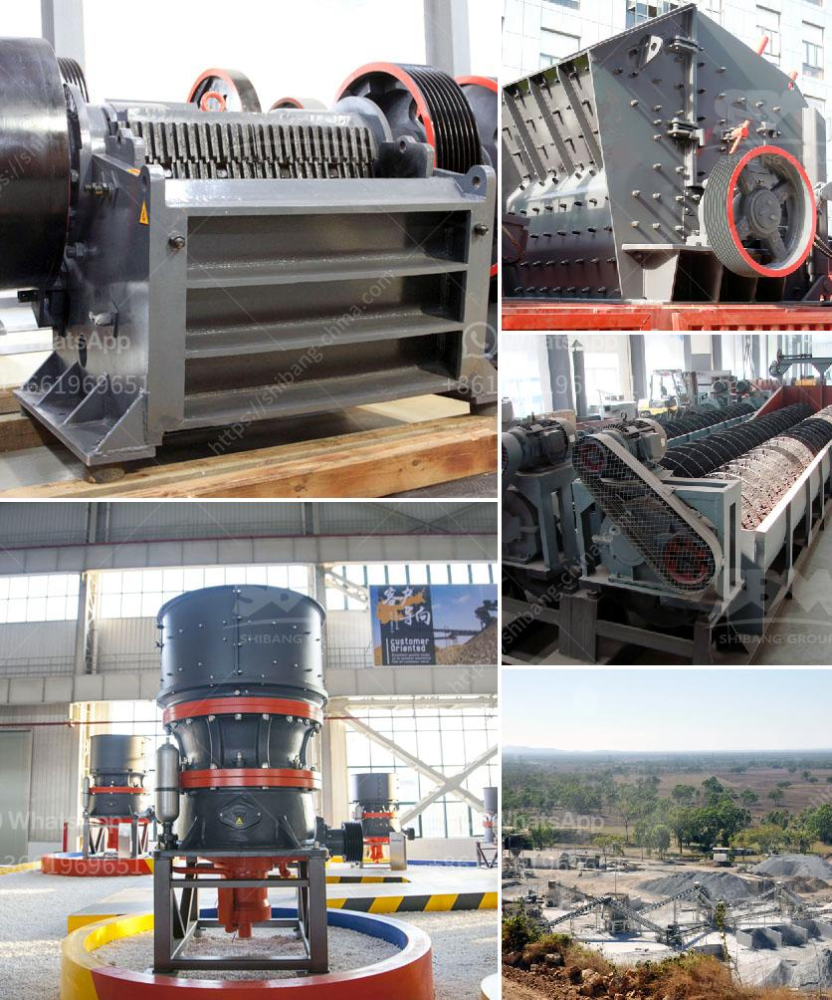

<h3>vibrating screen efficiency</h3>
Vibrating screens are widely used in various industrial applications such as mining, construction, and chemical industries to separate materials into different sizes for further processing or for end-use. However, the efficiency of these screens can vary greatly, depending on factors such as the type of material being processed, the size of the screen openings, and the operating parameters. In this article, we will explore the importance of vibrating screen efficiency and how it can be optimized.

Efficiency is a key performance indicator for vibrating screens. It is defined as the ratio of the undersized particles that pass through the screen surface to the total feed particles. A higher efficiency implies that a greater amount of undersized material is being separated, resulting in a more productive screening process.

There are several factors that can affect the efficiency of a vibrating screen. Firstly, the type of material being processed plays a significant role. Different materials have different physical properties, such as particle size, shape, and density, which can affect their ability to pass through the screen openings. For example, fine materials with a small particle size may easily pass through the screen, leading to a higher efficiency. Conversely, larger particles may get stuck or bounce off the screen surface, reducing the efficiency.

The size of the screen openings also impacts efficiency. Screens with larger openings allow more undersized material to pass through, resulting in a higher efficiency. However, the selection of screen opening size should be based on the desired product size and the properties of the material being screened. Using screens with very large openings may lead to excessive undersized material, which could affect downstream processes or product quality.

Another crucial factor is the operating parameters of the vibrating screen. The amplitude, frequency, and inclination angle can all influence the efficiency. Amplitude refers to the degree of vibration, while frequency represents the number of vibrations per second. Increasing the amplitude and frequency can help to improve the screening efficiency, as it enhances the movement of particles on the screen surface. However, excessively high amplitudes or frequencies may cause the screen to become overloaded, leading to reduced efficiency.

The inclination angle of the screen also plays a role in optimizing efficiency. By adjusting the angle, the material flow can be controlled, allowing it to spread evenly across the screen surface. An optimal inclination angle can prevent material from accumulating at one end of the screen, which could affect the separation efficiency.

To maximize vibrating screen efficiency, regular maintenance and inspections are essential. This includes checking the screen surface for signs of wear or damage, ensuring the screen tension is properly adjusted, and cleaning or replacing any worn-out screen panels. Additionally, routine lubrication of bearings and other moving parts can help to minimize friction and ensure smooth operation.

In conclusion, vibrating screen efficiency is crucial for any industrial application that involves the separation of materials. Factors such as material type, screen opening size, and operating parameters all affect the efficiency. By understanding these factors and implementing regular maintenance practices, operators can optimize the efficiency of their vibrating screens, leading to improved productivity and product quality.
<h3>Contact us</h3><ul><li><strong>Whatsapp:&nbsp;<a href="https://wa.me/8613661969651">+8613661969651</a></strong></li><li><a href="https://swt.shibang-china.com/?git&amp;zhl&amp;vibrating screen efficiency"><strong>Online Service(chat now)</strong></a></li></ul><h3>Related</h3><ul><li><a href='buy stone crusher in south africa.md'>buy stone crusher in south africa</a></li><li><a href='magnetita mineral cribado cantera planta trituradora.md'>magnetita mineral cribado cantera planta trituradora</a></li><li><a href='cement plant feasibility report.md'>cement plant feasibility report</a></li><li><a href='gypsum plant price.md'>gypsum plant price</a></li><li><a href='crushing processing equipment.md'>crushing processing equipment</a></li></ul>