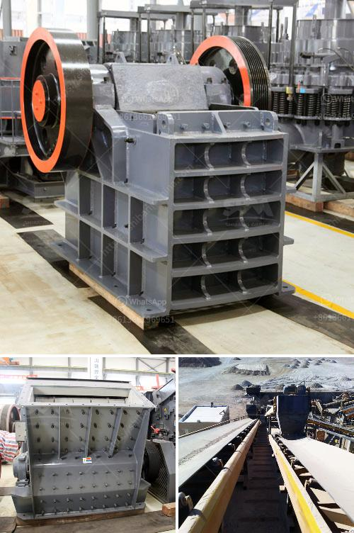

<h3>vibrating screen separator suppliers in philippines</h3>
Vibrating screen separators are commonly used in many industries for grading and screening materials. They are highly versatile machines that can perform various tasks such as screening, sizing, grading, dewatering, and desliming. In the Philippines, there are many suppliers of vibrating screen separators.

Vibrating screen separators are engineered to solve different separation problems in numerous industries. They are classified into two main types - circular and linear vibrating screens. Circular vibrating screen separators are widely used in the mining, construction, and chemical industries for various applications, including screening, grading, and sizing of materials. Linear vibrating screen separators, on the other hand, use linear motion to separate particles.

These machines are essential in the production process as they ensure the quality and consistency of the final product. Hence, it is crucial to find reliable suppliers of vibrating screen separators in the Philippines.

One of the reputable suppliers of vibrating screen separators in the Philippines is Jaykrishna Magnetics Pvt. Ltd. Established in 1978, the company has accumulated vast experience and expertise in manufacturing and supplying industrial magnetic equipment. They specialize in providing high-quality vibrating screen separators to various industries, including mining, food processing, ceramics, and pharmaceuticals.

Jaykrishna Magnetics Pvt. Ltd. offers a wide range of vibrating screen separators that are designed to meet the specific requirements of its clients. Their circular vibrating screen separators are known for their reliability and ease of use. These machines come with a robust construction, ensuring long-lasting performance even under heavy-duty conditions.

Another trusted supplier of vibrating screen separators in the Philippines is GTEK MINERAL TECHNOLOGIES CO., LIMITED. The company has been serving the industry for many years and has built a solid reputation for delivering high-quality equipment. They offer a comprehensive range of vibrating screen separators that cater to different industries' needs.

GTEK MINERAL TECHNOLOGIES CO., LIMITED provides both circular and linear vibrating screen separators. These machines are designed to achieve high efficiency with low operating costs. Their vibrating screen separators are equipped with advanced technology, ensuring accurate and reliable performance.

In addition to Jaykrishna Magnetics Pvt. Ltd. and GTEK MINERAL TECHNOLOGIES CO., LIMITED, there are other suppliers of vibrating screen separators in the Philippines. These include Eurotech Global Solution, Inc., Star Trace Pvt. Ltd., Vibro Equipments Pvt. Ltd., and Electro Magnetic Flux Industries.

When choosing a supplier of vibrating screen separators, it is important to consider factors such as the company's reputation, product quality, after-sales service, and competitive pricing. It is advisable to thoroughly research and compare different suppliers to make an informed decision.

In conclusion, vibrating screen separators play a crucial role in many industries in the Philippines. The quality and reliability of these machines are essential for achieving optimal production efficiency. Finding reputable suppliers of vibrating screen separators, such as Jaykrishna Magnetics Pvt. Ltd. and GTEK MINERAL TECHNOLOGIES CO., LIMITED, ensures that businesses can benefit from durable and high-performing equipment.
<h3>Contact us</h3><ul><li><strong>Whatsapp:&nbsp;<a href="https://wa.me/8613661969651">+8613661969651</a></strong></li><li><a href="https://swt.shibang-china.com/?git&amp;zhl&amp;vibrating screen separator suppliers in philippines"><strong>Online Service(chat now)</strong></a></li></ul><h3>Related</h3><ul><li><a href='jaw crusher in uzbekistan.md'>jaw crusher in uzbekistan</a></li><li><a href='impact crusher mesh.md'>impact crusher mesh</a></li><li><a href='the estimated cost of setting up a quarry.md'>the estimated cost of setting up a quarry</a></li><li><a href='super fine grinding machine price in india.md'>super fine grinding machine price in india</a></li><li><a href='gravel crusher for sale.md'>gravel crusher for sale</a></li></ul>