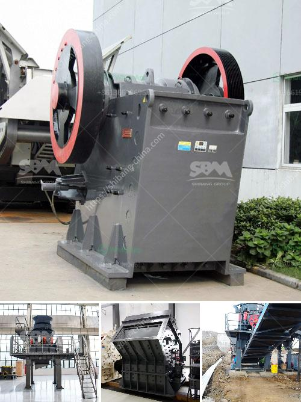

<h3>vibrating screens in italy</h3>
Vibrating screens are a fundamental piece of equipment for many industries in Italy. As a country renowned for its manufacturing tradition and expertise in various sectors, Italy is a well-known hub for global exports. One of the industries that greatly benefit from the use of vibrating screens is the mining industry. However, vibrating screens are also widely utilized in the construction, chemical, and food processing sectors.

A vibrating screen is a machine tool that is commonly used to separate or classify solids, liquids, and powders. The mechanism behind this equipment involves a series of vibrating decks or screens, which vibrate at a particular frequency to help finesse the desired product outcome. While different vibrating screens possess various designs, they all operate with the same principle.

In Italy, vibrating screens are primarily manufactured by leading industrial machinery manufacturers who have specialized in this field. These companies produce high-quality vibrating screens that are robust, reliable, and efficient. Some of the well-known Italian manufacturers include HTT, Erimaki, Vibrowest, and OLI. These companies provide vibrating screens with different features and options to meet diverse industry requirements.

The mining industry in Italy has witnessed substantial growth over the years. Vibrating screens play a vital role in this sector as they assist in the extraction and processing of various minerals. Whether it is iron ore, coal, or precious metals, vibrating screens are used to segregate the materials based on their size and quality. This ensures that only the desired materials are processed further, increasing the efficiency of mining operations.

In the construction industry, vibrating screens are used for aggregate separation, which is crucial in the production of high-quality concrete and asphalt. These screens help in efficiently separating different sizes of stones, gravel, and sand, ensuring that the final product adheres to the required specifications. Vibrating screens also help in reducing waste by ensuring that only the appropriate-sized materials are used in construction projects.

Chemical industries in Italy rely on vibrating screens for various applications. In the manufacturing of chemicals, these screens aid in separating different particles based on their size and characteristics. They are also used in the pharmaceutical industry to sift and classify materials to meet specific standards. The use of vibrating screens in these sectors ensures higher product quality, reduced material waste, and increased production efficiency.

The food processing industry also benefits greatly from vibrating screens in Italy. These screens are used in the separation and sorting of different food products during processing. Whether it is grading fruits and vegetables based on size or filtering out foreign particles, vibrating screens help maintain product quality and keep consumers safe.

In conclusion, vibrating screens are widely utilized in various industries in Italy. The mining, construction, chemical, and food processing sectors greatly benefit from the use of these machines. Italy, known for its expertise in manufacturing, boasts several reputable companies producing high-quality vibrating screens. With efficiency, reliability, and robustness, these vibrating screens contribute to higher productivity, improved product quality, and reduced waste in countless Italian industries.
<h3>Contact us</h3><ul><li><strong>Whatsapp:&nbsp;<a href="https://wa.me/8613661969651">+8613661969651</a></strong></li><li><a href="https://swt.shibang-china.com/?git&amp;zhl&amp;vibrating screens in italy"><strong>Online Service(chat now)</strong></a></li></ul><h3>Related</h3><ul><li><a href='sand crusher machine manufacturers.md'>sand crusher machine manufacturers</a></li><li><a href='copper concentrate processing equipment.md'>copper concentrate processing equipment</a></li><li><a href='ball mill grinders cost.md'>ball mill grinders cost</a></li><li><a href='malaysia mineral ball mill.md'>malaysia mineral ball mill</a></li><li><a href='rental mesin stone crusher.md'>rental mesin stone crusher</a></li></ul>