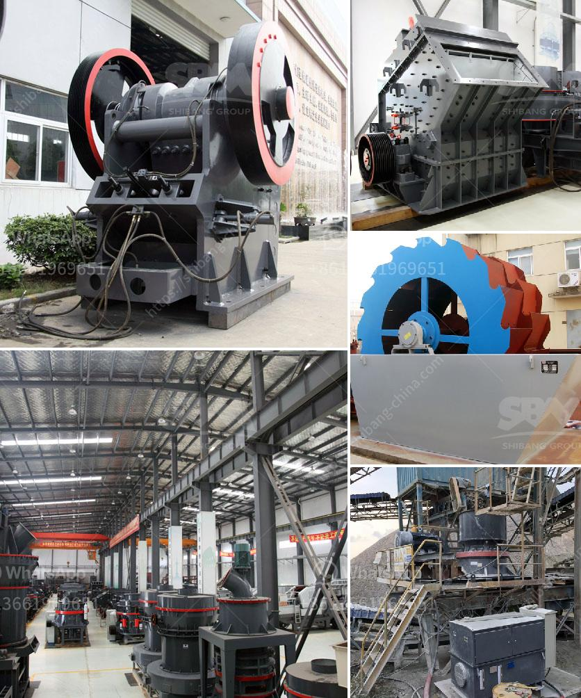

<h3>vibrating wire screen suppliers</h3>
Vibrating wire screens are a vital component in many industries, including mining, construction, agriculture, and recycling. These screens are designed to efficiently separate particles of different sizes to ensure the quality and consistency of the final product. To obtain the best quality wire screens, it is crucial to choose a reliable and reputable vibrating wire screen supplier.

There are numerous suppliers in the market, and selecting the right one can be challenging. However, it is important to prioritize certain factors to ensure a successful partnership. The first crucial aspect to consider is the supplier's experience and expertise in manufacturing vibrating wire screens. Look for suppliers with a well-established track record, preferably those that have been in the industry for several years. Experienced suppliers are more likely to have a deeper understanding of customer needs, which enables them to design and produce efficient and durable wire screens.

Another important factor is the quality of materials and components used in manufacturing the wire screens. High-quality materials ensure the durability and longevity of the screens, even in demanding working conditions. When selecting a supplier, inquire about the types of materials they use and whether they adhere to higher industry standards. It is also beneficial to consider suppliers who invest in research and development to continuously improve their products' performance.

Additionally, it is essential to choose a supplier that offers customizable options. Different industries have diverse requirements, and having the flexibility to adapt wire screens to specific needs is crucial. A supplier that can provide customized solutions can ensure optimal performance, leading to increased productivity and efficiency.

Prompt delivery and excellent customer service are also significant considerations when selecting a vibrating wire screen supplier. A reliable supplier should have the capability to deliver screens in a timely manner to avoid disruptions in operations. Additionally, having a responsive and attentive customer service team can assist in addressing any concerns or issues that may arise during or after the purchase process.

Another way to evaluate the reliability and reputation of a supplier is by reviewing their customer feedback and testimonials. Look for suppliers with positive reviews and a good reputation in the industry. This indicates their commitment to providing quality products and excellent service.

Lastly, consider the pricing offered by the supplier. While it is important to find a cost-effective solution, the emphasis should be on the overall value rather than solely focusing on the lowest price. Balance the quality, reliability, and customization options offered by the supplier with their pricing to identify the best fit for your organization.

In conclusion, selecting the right vibrating wire screen supplier is crucial for industries that rely on these screens for their operations. Considering factors such as experience, quality of materials, customization options, delivery reliability, customer service, and pricing can help identify a reliable and reputable supplier. Taking the time to research and evaluate different suppliers will ultimately lead to a successful and long-lasting relationship that will benefit your organization.
<h3>Contact us</h3><ul><li><strong>Whatsapp:&nbsp;<a href="https://wa.me/8613661969651">+8613661969651</a></strong></li><li><a href="https://swt.shibang-china.com/?git&amp;zhl&amp;vibrating wire screen suppliers"><strong>Online Service(chat now)</strong></a></li></ul><h3>Related</h3><ul><li><a href='maintenance plan of crusher.md'>maintenance plan of crusher</a></li><li><a href='old used coal washing plants.md'>old used coal washing plants</a></li><li><a href='portable crusher rental in las vegas.md'>portable crusher rental in las vegas</a></li><li><a href='coal pulverizing mills.md'>coal pulverizing mills</a></li><li><a href='coal washing process machine.md'>coal washing process machine</a></li></ul>