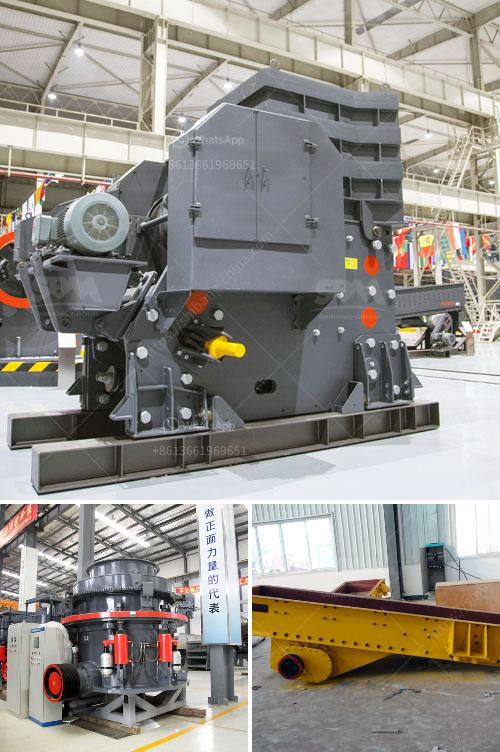

<h3>vibrations roller mills</h3>
In the realm of industrial grinding, roller mills have become a crucial part of the process. These mills are widely used in various industries, including mining, construction, and pharmaceuticals, to grind materials into fine powders. With advancements in technology, vibrations roller mills have emerged as a game-changer, offering improved efficiency and productivity.

Vibrations roller mills operate on a simple principle: a rotating drum with multiple cylinders or rollers that crush and grind materials against a stationary surface. The vibration aspect in these mills adds an additional dimension to the grinding process, enhancing its effectiveness and efficiency. Here, we delve deeper into the benefits of vibrations roller mills and how they contribute to the overall grinding process.

One of the primary advantages of vibrations roller mills is their ability to produce finer and more uniform particles. The vibrations introduced during the grinding process create a continuous and uniform movement of the material, leading to consistent particle size reduction. This uniformity is crucial in industries like pharmaceuticals, where precise particle size distribution is essential for drug formulation and efficacy.

Moreover, vibrations roller mills also improve the overall grinding efficiency. The vibrations help in breaking down the feed material more effectively, thereby reducing energy requirements. By requiring less energy, these mills contribute to energy savings and reduce operational costs. The enhanced efficiency also leads to higher throughput rates, enabling industries to process larger quantities of material in a shorter time frame.

Another significant advantage of vibrations roller mills is their ability to handle a wide range of materials. These mills can efficiently grind a variety of materials, including minerals, ores, chemicals, and agricultural products. This versatility makes them a preferred choice across multiple industries, as they can be easily adapted to the specific needs and requirements of different materials.

One of the challenges associated with roller mills is the potential of material accumulation or blockage, which can impede the grinding process and reduce efficiency. However, vibrations roller mills address this issue by actively preventing material accumulation. The vibrations help to maintain a constant flow of material through the mill, avoiding clogging and ensuring uninterrupted operation.

Furthermore, vibrations roller mills also offer advantages in terms of maintenance and operation. The dynamic nature of these mills helps to reduce wear and tear on the equipment, resulting in longer service life and reduced downtime for maintenance. Additionally, the vibrations aid in self-cleaning, preventing the accumulation of debris or contaminants within the mill, further enhancing its operational reliability.

In conclusion, vibrations roller mills have revolutionized the grinding process in several industries. These mills offer numerous benefits, including improved particle size distribution, enhanced grinding efficiency, and the ability to process a wide range of materials. By actively preventing material blockage and offering ease of maintenance and operation, vibrations roller mills contribute to increased productivity and reduced operational costs. As technology continues to advance, vibrations roller mills are likely to play an even more significant role in the future of industrial grinding.
<h3>Contact us</h3><ul><li><strong>Whatsapp:&nbsp;<a href="https://wa.me/8613661969651">+8613661969651</a></strong></li><li><a href="https://swt.shibang-china.com/?git&amp;zhl&amp;vibrations roller mills"><strong>Online Service(chat now)</strong></a></li></ul><h3>Related</h3><ul><li><a href='mini robo sand unit price in india.md'>mini robo sand unit price in india</a></li><li><a href='how to identify rear roll in the two roll mill.md'>how to identify rear roll in the two roll mill</a></li><li><a href='magnetita mineral cribado cantera planta trituradora.md'>magnetita mineral cribado cantera planta trituradora</a></li><li><a href='cement factories equipment in south africa.md'>cement factories equipment in south africa</a></li><li><a href='silicon ore processing equipment.md'>silicon ore processing equipment</a></li></ul>