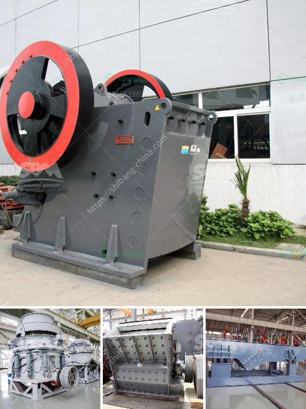

<h3>vibratory ball mill china</h3>
Vibratory ball mills have gained popularity in recent years due to their ability to finely grind materials to a size of microns or even nanometers. These mills utilize a shaking or oscillatory motion in combination with high-energy impacts to pulverize the material. Vibratory ball mills are highly efficient and compact, making them ideal for grinding a wide range of materials, including metals, ceramics, and pharmaceuticals.

One of the leading manufacturers of vibratory ball mills in China is Xingyang Mining Machinery. Founded in 2003, Xingyang Mining Machinery is a professional manufacturer of mining equipment and has more than 20 years of experience in the production of vibratory ball mills. It has a unique technical advantage in the design and production of high-frequency oscillatory ball mills.

The vibratory ball mill produced by Xingyang Mining Machinery is powered by a 240V direct-drive motor and a PLC controller. It uses high-quality wear-resistant components and a special grinding chamber designed to withstand high-speed impacts. The milling chamber is filled with small stainless steel balls or zirconia beads, which collide and grind the material into ultrafine particles.

The advantages of vibratory ball mills include their high grinding efficiency, low noise, and improved particle size distribution. Additionally, these mills are easy to operate and maintain, making them a popular choice among researchers and industrial users alike. The compact size makes them suitable for use in small-scale laboratories or production facilities with limited space.

In conclusion, vibratory ball mills from China, such as the one manufactured by Xingyang Mining Machinery, offer a cost-effective, low-impact, and efficient way to grind materials. These mills have become an essential tool in research laboratories and industries that require fine grinding of materials. With advancements in technology and continuous innovation, vibratory ball mills are likely to become even more sophisticated and versatile in the future.
<h3>Contact us</h3><ul><li><strong>Whatsapp:&nbsp;<a href="https://wa.me/8613661969651">+8613661969651</a></strong></li><li><a href="https://swt.shibang-china.com/?git&amp;zhl&amp;vibratory ball mill china"><strong>Online Service(chat now)</strong></a></li></ul><h3>Related</h3><ul><li><a href='jaw crusher saudi small capacity.md'>jaw crusher saudi small capacity</a></li><li><a href='used crusher price in nigeria.md'>used crusher price in nigeria</a></li><li><a href='mini crusher hire johannesburg.md'>mini crusher hire johannesburg</a></li><li><a href='coal mining plant in ethiopia.md'>coal mining plant in ethiopia</a></li><li><a href='stone crusher with tractor.md'>stone crusher with tractor</a></li></ul>