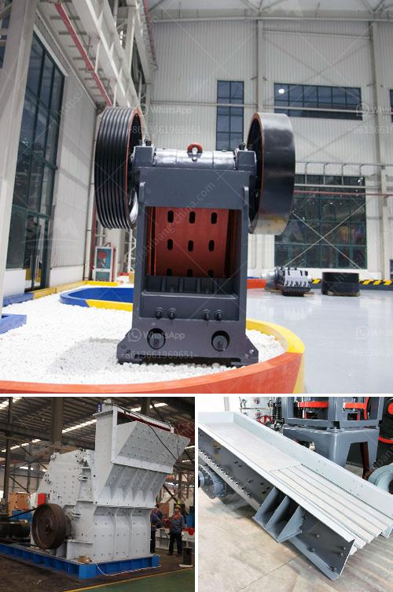

<h3>vibratory feeder manufacturer china</h3>
When it comes to manufacturing industries, having reliable and efficient equipment is vital for maintaining productivity and success. One such equipment that plays a crucial role in various industries is the vibratory feeder. Known for its ability to rapidly and evenly distribute materials, vibratory feeders are indispensable in industries such as mining, construction, pharmaceuticals, and food processing.

Among the leading manufacturers of vibratory feeders is China. The country's vibratory feeder manufacturers have gained a solid reputation for delivering high-quality products that guarantee exceptional performance and durability. These manufacturers leverage advanced technologies and engineering expertise to meet the diverse requirements of their customers worldwide.

One of the key advantages of vibratory feeders manufactured in China is their cost-effectiveness. Thanks to the country's vast manufacturing capabilities and lower labor costs, Chinese manufacturers can offer competitive pricing without compromising on quality. This advantage has made China a top choice for businesses looking to maximize their investments while obtaining top-notch vibratory feeders.

Chinese vibratory feeder manufacturers also prioritize innovation and quality control. They invest heavily in research and development to enhance their product offerings constantly. Advanced technologies, such as computer-aided design (CAD) and simulation, enable precise prototyping and testing. Furthermore, rigorous quality control measures guarantee that each feeder meets or exceeds the highest industry standards.

Another compelling reason why China is a go-to destination for vibratory feeders is the wide range of customization options available. Manufacturers in China understand that different industries have unique requirements, and customization ensures that the vibratory feeders seamlessly integrate into existing production lines. Whether it's adjusting the size, capacity, or materials used, Chinese manufacturers possess the flexibility to accommodate specific customer needs.

Furthermore, Chinese vibratory feeder manufacturers prioritize robust after-sales support. They understand that a strong relationship with customers extends beyond the purchase. From installation assistance to timely maintenance and repairs, Chinese manufacturers prioritize customer satisfaction. Through effective communication channels, customers can rely on quick and reliable technical support, ensuring minimal downtime and uninterrupted operation.

When choosing a vibratory feeder manufacturer in China, it is essential to consider their certifications and adherence to international standards. Reputable manufacturers adhere to ISO 9001:2015, CE, and RoHS certifications, ensuring compliance with international quality and safety requirements. These certifications serve as a testimony to their commitment to delivering reliable and safe vibratory feeders.

In conclusion, vibratory feeders are indispensable in various industries, and Chinese manufacturers have established themselves as leaders in this field. With their advanced technologies, customization options, cost-effectiveness, and robust after-sales support, they continue to cater to the evolving needs of their customers globally. Whether it's mining, construction, pharmaceuticals, or food processing, vibratory feeder manufacturers in China are trusted partners in delivering quality and efficiency to various manufacturing industries.
<h3>Contact us</h3><ul><li><strong>Whatsapp:&nbsp;<a href="https://wa.me/8613661969651">+8613661969651</a></strong></li><li><a href="https://swt.shibang-china.com/?git&amp;zhl&amp;vibratory feeder manufacturer china"><strong>Online Service(chat now)</strong></a></li></ul><h3>Related</h3><ul><li><a href='talcum powder mill manufacturing.md'>talcum powder mill manufacturing</a></li><li><a href='vibrating screen separator suppliers in philippines.md'>vibrating screen separator suppliers in philippines</a></li><li><a href='crusher supplier china.md'>crusher supplier china</a></li><li><a href='manufactures mineral crusher oruro bolivia.md'>manufactures mineral crusher oruro bolivia</a></li><li><a href='hammer mills for stone.md'>hammer mills for stone</a></li></ul>