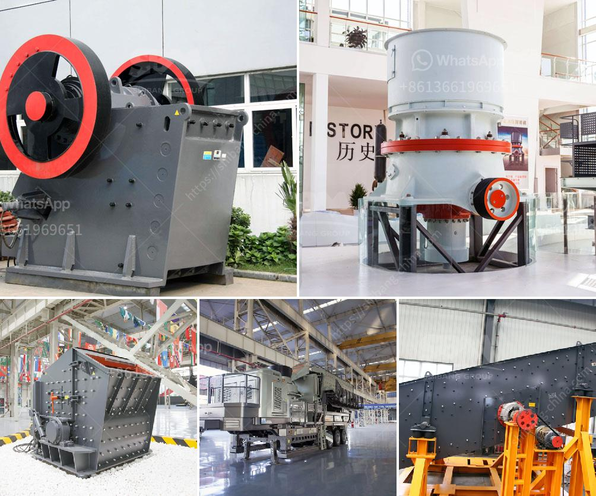

<h3>vibratory screen design</h3>
Vibratory screens are widely used in many industries for screening and separating materials. The key to their successful design lies in their ability to continuously vibrate at a high frequency. This vibration is responsible for the efficient separation of particles and the overall performance of the screen.

The design of a vibratory screen starts with the selection of a suitable vibration motor. The motor’s power and speed need to be chosen based on the desired capacity and the size of the material being screened. The motor is typically mounted to the side of the screen and connected to it using a series of springs. These springs act as a suspension system, allowing the screen to vibrate freely and evenly distribute the vibration energy.

The screen deck is the actual surface on which the material is screened. It consists of a series of parallel bars or wires that allow the particles to pass through. The spacing between these bars or wires determines the size of the particles that can pass through. The design of the screen deck depends on the specific application and the desired particle size distribution.

To enhance the efficiency of the screening process, additional features can be incorporated into the vibratory screen design. For example, inclining the screen deck can increase the screening capacity by allowing the material to pass through more quickly. Additionally, adding a series of bouncing balls or rubber balls on the screen deck can aid in the separation of fine particles by preventing them from clogging the screen openings.

In conclusion, the design of a vibratory screen plays a crucial role in its performance and efficiency. Factors such as motor selection, screen deck design, and additional features all contribute to the overall effectiveness of the screen. By carefully considering these design aspects, industries can optimize their screening processes and improve the quality of their products.
<h3>Contact us</h3><ul><li><strong>Whatsapp:&nbsp;<a href="https://wa.me/8613661969651">+8613661969651</a></strong></li><li><a href="https://swt.shibang-china.com/?git&amp;zhl&amp;vibratory screen design"><strong>Online Service(chat now)</strong></a></li></ul><h3>Related</h3><ul><li><a href='basalt crushing machinery processing line.md'>basalt crushing machinery processing line</a></li><li><a href='m sand manufacturing project report.md'>m sand manufacturing project report</a></li><li><a href='grinding tunbe mill and ball mill.md'>grinding tunbe mill and ball mill</a></li><li><a href='copper ore complete concentrating method.md'>copper ore complete concentrating method</a></li><li><a href='price hammer mill price mill pulverizer.md'>price hammer mill price mill pulverizer</a></li></ul>