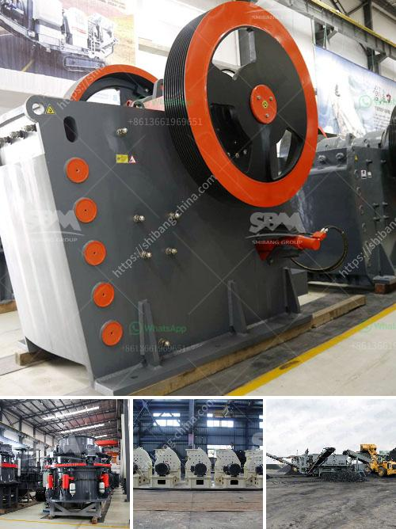

<h3>vibratory screen south africa</h3>
In the bustling metropolis of South Africa, a country renowned for its rich mineral resources, it comes as no surprise that the need for effective material sorting techniques has become of paramount importance. Enter vibratory screens, a game-changing technology that has revolutionized the mining and construction industries by simplifying the process of sorting and separating materials efficiently.

Vibratory screens are high-performance machines that utilize vibrations to separate materials based on their particle size. These screens have gained significant popularity in South Africa due to their ability to streamline the sorting process, enhance productivity, and improve overall operational efficiency.

One of the key advantages of vibratory screens is their versatility. They can handle a wide range of materials, including aggregates, minerals, ores, and industrial by-products. The screens come in various designs and configurations, enabling users to customize their operations according to their specific requirements. Whether it is scalping, sizing, dewatering, or any other sorting application, vibratory screens can be tailored to deliver optimal results.

South Africa's mining and construction sectors have been the primary beneficiaries of this technology. Vibratory screens in mining operations help extract valuable minerals from rock formations by separating them efficiently. The screens' ability to classify materials according to size ensures that only the desired particles are sent for further processing, resulting in reduced wastage and increased productivity.

In the construction industry, vibratory screens aid in sorting and grading aggregates for various applications. They eliminate oversize particles, ensuring that the final product meets the required specifications. Additionally, these screens facilitate the recycling of construction and demolition waste by effectively separating different materials for reusability, leading to sustainable practices.

The vibratory screen market in South Africa is continuously evolving, with manufacturers consistently introducing innovative designs and features. Some screens now incorporate advanced technologies such as high-frequency vibrations and anti-blinding mechanisms, further enhancing their efficiency and minimizing downtime.

As South Africa's mining and construction industries continue to flourish, the demand for vibratory screens is poised to surge. These machines offer unmatched efficiency, improved productivity, and cost-effective material sorting, making them an invaluable asset in various sectors.

In conclusion, vibratory screens are revolutionizing the sorting and separation of materials in South Africa. Their versatility and efficiency provide a competitive edge to mining and construction companies, enabling them to unlock the full potential of their operations. As the market evolves and manufacturers continue to invest in research and development, vibratory screens will only become more advanced and indispensable, catering to the ever-growing needs of the South African industries.
<h3>Contact us</h3><ul><li><strong>Whatsapp:&nbsp;<a href="https://wa.me/8613661969651">+8613661969651</a></strong></li><li><a href="https://swt.shibang-china.com/?git&amp;zhl&amp;vibratory screen south africa"><strong>Online Service(chat now)</strong></a></li></ul><h3>Related</h3><ul><li><a href='turkey cone crusher kenya.md'>turkey cone crusher kenya</a></li><li><a href='vibrating screen capacity calculation.md'>vibrating screen capacity calculation</a></li><li><a href='calculating capacity of a roll crusher.md'>calculating capacity of a roll crusher</a></li><li><a href='100 tph stone crushers with vsi in india.md'>100 tph stone crushers with vsi in india</a></li><li><a href='high speed hand powder crushing machine.md'>high speed hand powder crushing machine</a></li></ul>