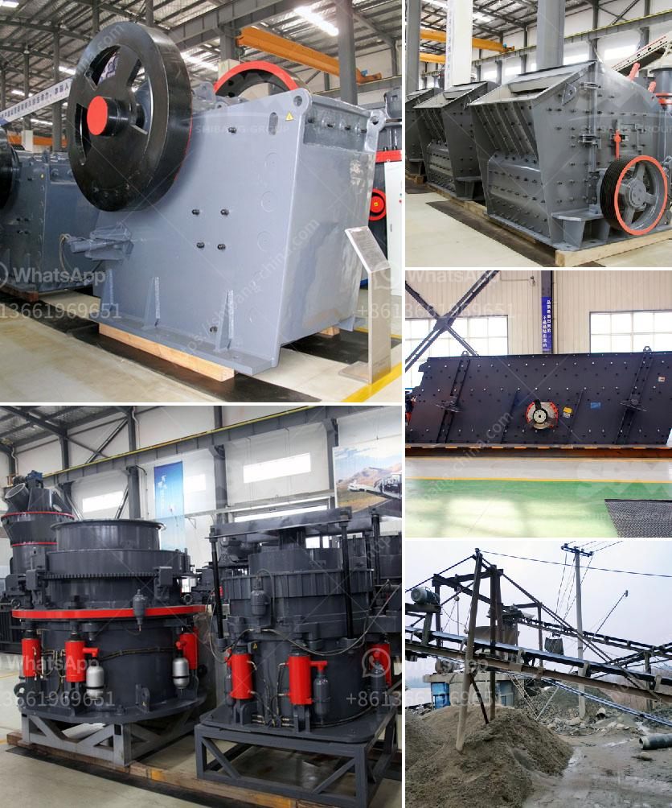

<h3>vrm cement plant</h3>
The cement industry has been a significant contributor to global carbon emissions and environmental degradation for decades. However, with the advancements in technology and growing concerns for sustainability, a new era in cement production has emerged. The VRM cement plant is one such revolution poised to transform the industry through its innovative approach to manufacturing.

VRM stands for Vertical Roller Mill, a groundbreaking technology that has gained significant traction in recent years. Unlike traditional cement production methods, VRM plants employ vertical roller mills instead of ball mills to grind the raw materials. This groundbreaking technology allows for a more efficient, energy-saving, and environmentally friendly cement production process.

One of the key benefits of a VRM cement plant is its energy efficiency. Vertical roller mills consume considerably less energy than conventional ball mills, resulting in a significant reduction in carbon emissions and operating costs. This energy-saving technology has caught the attention of industry leaders and regulatory bodies seeking to reduce the carbon footprint of cement production.

Additionally, the VRM cement plant can utilize a wider range of raw materials in the manufacturing process. This flexibility allows for a reduction in dependency on traditional raw materials, such as limestone, while incorporating supplementary cementitious materials like fly ash and slag. By diversifying the raw materials, VRM plants contribute to sustainable mining practices and reduce the environmental impact caused by excessive mining activities.

Furthermore, the vertical roller mills used in VRM cement plants offer improved grinding efficiency, leading to higher quality cement production. The precise control of the grinding process ensures consistent cement particle size distribution, enhancing the strength, durability, and overall performance of the final product. This results in a cement that meets stringent quality standards and customer expectations.

In conclusion, the VRM cement plant represents a significant revolution in the cement industry. Its energy efficiency, utilization of a broader range of raw materials, and improved grinding efficiency make it a frontrunner in sustainable cement production. As the demand for environmentally friendly cement grows, VRM plants can play a pivotal role in meeting this demand while reducing carbon emissions and operating costs. The adoption of VRM technology marks a positive shift towards a greener and more sustainable future for the cement industry.
<h3>Contact us</h3><ul><li><strong>Whatsapp:&nbsp;<a href="https://wa.me/8613661969651">+8613661969651</a></strong></li><li><a href="https://swt.shibang-china.com/?git&amp;zhl&amp;vrm cement plant"><strong>Online Service(chat now)</strong></a></li></ul><h3>Related</h3><ul><li><a href='portable crushing plant.md'>portable crushing plant</a></li><li><a href='stone crusher guptas.md'>stone crusher guptas</a></li><li><a href='quartz crushing project report.md'>quartz crushing project report</a></li><li><a href='ball mills in limpets.md'>ball mills in limpets</a></li><li><a href='jaw crusher for sale in auction.md'>jaw crusher for sale in auction</a></li></ul>