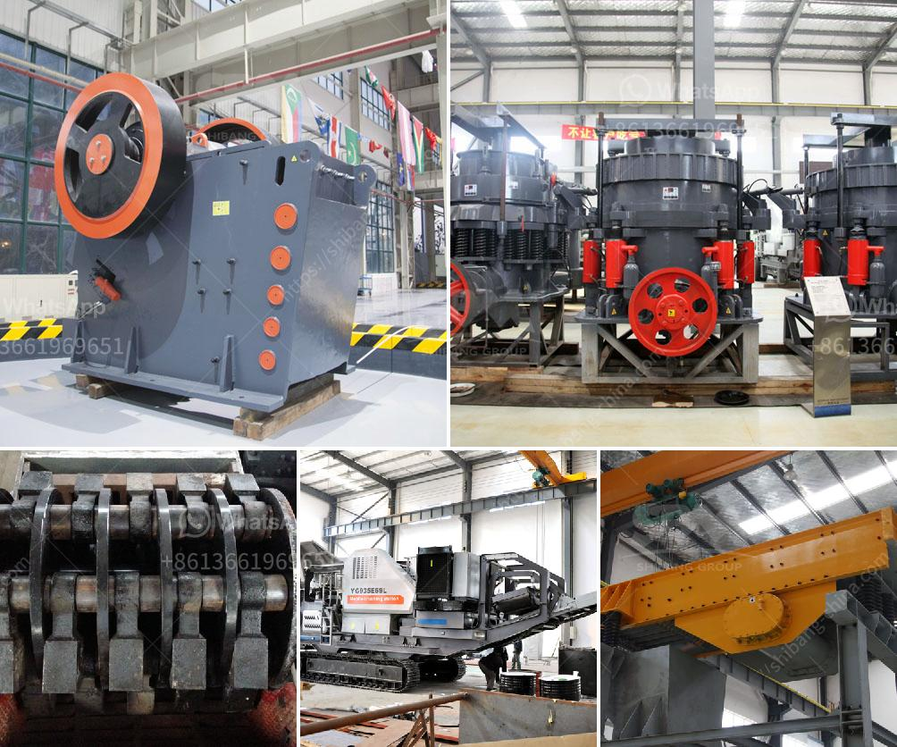

<h3>waived diamond mesh equipment south africa</h3>
South Africa, a nation known for its vibrant diamond mining industry, is now witnessing a growing demand for waived diamond mesh equipment. This specialized equipment plays a critical role in various industries, including security, agriculture, construction, and mining, due to its durability, versatility, and cost-effectiveness. In this article, we will explore the significance of waived diamond mesh equipment in South Africa and delve into its various applications.

Waived diamond mesh equipment refers to machinery used to produce diamond mesh fencing or netting. This fencing typically consists of wire strung in a rhombus pattern, making it sturdy and resistant to external pressures. The meshes are generally made of galvanized steel wire, ensuring optimal strength and durability even in harsh environments, such as South Africa's diverse climates.

Waived diamond mesh fencing is widely used in securing residential, commercial, and industrial areas. Due to its high-tensile strength and robust construction, it acts as an effective barrier against unauthorized entry, theft, and vandalism. Additionally, its see-through design allows for optimal surveillance capabilities.

South Africa's thriving agricultural sector benefits greatly from waived diamond mesh equipment. These fences serve as enclosures for livestock farming, protecting animals from external threats while permitting proper ventilation. They are also valuable in keeping pests away from crops, ensuring higher agricultural yields.

Waived diamond mesh fencing is indispensable in construction zones. It acts as a safety barrier keeping unauthorized individuals away from hazardous areas, protecting both workers and passersby. Additionally, the fencing provides stability during construction, preventing the accidental displacement of materials or vehicles.

Given South Africa's significant diamond mining industry, waived diamond mesh equipment finds extensive use in providing secure enclosures for mining sites. These fences prevent unauthorized access while enabling ventilation and visibility for efficient mine operations. They also act as a vital safety measure, reducing the risk of accidents or unauthorized mining activities.

Waived diamond mesh equipment produces fencing that is highly durable and resistant to wear and tear, ensuring long-term usage without the need for frequent repairs or replacements. This feature makes it a cost-effective solution for various sectors.

The diamond mesh fencing produced by this equipment can be adapted to various sizes and heights, catering to diverse needs across industries. Its flexibility enables seamless customization according to specific requirements.

The galvanized steel wire used in the fencing reduces the need for maintenance, as it is resistant to rust and corrosion. The fencing can withstand extreme weather conditions, ensuring its longevity without compromising functionality.

Waived diamond mesh equipment plays a pivotal role in numerous sectors within South Africa, enabling security, protection, and enhanced productivity. Its robust construction, versatility, and cost-effectiveness make it a go-to solution for various applications across the country. As demand continues to grow, the importance of waived diamond mesh equipment in South Africa's development cannot be overstated.
<h3>Contact us</h3><ul><li><strong>Whatsapp:&nbsp;<a href="https://wa.me/8613661969651">+8613661969651</a></strong></li><li><a href="https://swt.shibang-china.com/?git&amp;zhl&amp;waived diamond mesh equipment south africa"><strong>Online Service(chat now)</strong></a></li></ul><h3>Related</h3><ul><li><a href='iron ore crushed machine second hand.md'>iron ore crushed machine second hand</a></li><li><a href='malaysia sand washer supplier.md'>malaysia sand washer supplier</a></li><li><a href='gypsum powder uses in construction.md'>gypsum powder uses in construction</a></li><li><a href='gypsum plant price.md'>gypsum plant price</a></li><li><a href='the product of the stone crusher.md'>the product of the stone crusher</a></li></ul>