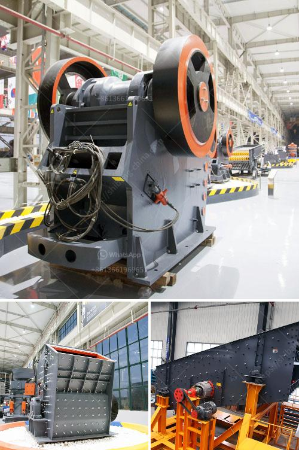

<h3>want mobile crusher on rent pune india</h3>
As the second-largest city in Maharashtra, Pune has become a prominent hub for various industries. One of the most crucial sectors contributing to its development is infrastructure. With rapid urbanization and the increasing demand for housing, the need for mobile crushers on rent in Pune, India has gained immense popularity.

Mobile crushers are vital for construction projects, where it is necessary to break down large rocks into smaller stones or gravel. These crushers are often used in quarrying, mining, construction, demolition, and recycling operations, making them highly versatile machines. The mobility aspect of these crushers allows contractors to move them easily from one site to another, providing flexibility and efficiency.

Renting a mobile crusher in Pune can benefit construction companies that require timely and cost-effective solutions. By utilizing state-of-the-art machinery, contractors can drastically reduce operational costs associated with transportation, labor, and equipment maintenance. With the option of renting, companies can access a wide range of crushers based on their specific project requirements. They can choose from a variety of sizes, types, and capacities that best suit their needs.

Renting mobile crushers in Pune also eliminates the need for procuring additional machinery, which saves businesses from heavy investments. Moreover, contractors can ensure a continuous supply of crushed material without having to invest in stockpiles. This results in significant savings in storage and handling costs.

The rental market for mobile crushers in Pune, India is expanding due to the increasing growth of infrastructure projects, such as highways, bridges, airports, and railways. These projects create a steady demand for mobile crushers, considering the numerous benefits they provide. As technology advances, there is a wider range of crushers available to meet varied crushing requirements and cater to different types of materials.

In conclusion, the availability of mobile crushers on rent in Pune, India presents a lucrative opportunity for businesses in the construction and infrastructure industry. With the increasing demand for aggregates and high-quality materials, these crushers offer a cost-effective and efficient solution. Renting mobile crushers in Pune enables contractors to save time, money, and effort while meeting project deadlines successfully. It is undoubtedly an advantageous choice for companies seeking affordable and flexible crushing solutions.
<h3>Contact us</h3><ul><li><strong>Whatsapp:&nbsp;<a href="https://wa.me/8613661969651">+8613661969651</a></strong></li><li><a href="https://swt.shibang-china.com/?git&amp;zhl&amp;want mobile crusher on rent pune india"><strong>Online Service(chat now)</strong></a></li></ul><h3>Related</h3><ul><li><a href='mobile crushing plant for rent in saudi arabia.md'>mobile crushing plant for rent in saudi arabia</a></li><li><a href='aggregate quarry crusher operation cost.md'>aggregate quarry crusher operation cost</a></li><li><a href='start a stone crusher.md'>start a stone crusher</a></li><li><a href='limestone grinding system.md'>limestone grinding system</a></li><li><a href='jaw crushers in harare zimbabwe.md'>jaw crushers in harare zimbabwe</a></li></ul>