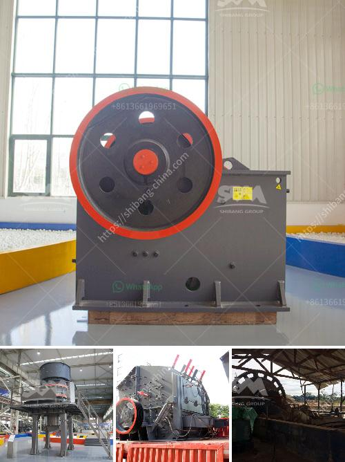

<h3>washing machine for small scale mining in ghana</h3>
Washing machines play a crucial role in various industries, including small-scale mining in Ghana. Small-scale mining often involves the extraction of precious minerals or metals using basic tools and techniques. However, this process can generate a significant amount of ore and debris that needs to be processed efficiently to increase productivity and reduce environmental impact. This is where washing machines come into play.

In the small-scale mining sector, washing machines are used to wash ores and separate valuable minerals from unwanted materials. These machines are specially designed to handle large quantities of ore and effectively clean them. They utilize water and mechanical agitation to break down the ore, removing dirt, clays, and other impurities. This results in a higher concentration of valuable minerals, making the extraction process more efficient.

One of the key advantages of using washing machines in small-scale mining is their ability to process a large volume of ore in a relatively short time. This not only increases productivity but also minimizes the time and effort required for manual processing. Additionally, washing machines improve the overall quality of the extracted minerals, enabling miners to fetch better prices in the market.

Furthermore, washing machines have a positive environmental impact on small-scale mining operations in Ghana. By effectively separating valuable minerals from unwanted materials, these machines help minimize the environmental footprint of the mining process. They reduce the amount of waste generated and prevent the contamination of nearby water sources with harmful chemicals commonly used in manual ore processing.

In conclusion, washing machines are essential equipment for small-scale mining in Ghana. They facilitate the processing of large quantities of ore and improve the overall productivity and profitability of mining operations. Moreover, they contribute to reducing the environmental impact of mining activities by minimizing waste and preventing water pollution. With the assistance of washing machines, small-scale miners in Ghana can enhance their efficiency and sustainability, ultimately benefiting both the industry and the local communities.
<h3>Contact us</h3><ul><li><strong>Whatsapp:&nbsp;<a href="https://wa.me/8613661969651">+8613661969651</a></strong></li><li><a href="https://swt.shibang-china.com/?git&amp;zhl&amp;washing machine for small scale mining in ghana"><strong>Online Service(chat now)</strong></a></li></ul><h3>Related</h3><ul><li><a href='gold washer machine manufacturer.md'>gold washer machine manufacturer</a></li><li><a href='stone crushing plant germany.md'>stone crushing plant germany</a></li><li><a href='1000 ton crusher.md'>1000 ton crusher</a></li><li><a href='sand manufacturing machines china.md'>sand manufacturing machines china</a></li><li><a href='cement plant cost estimation cement plant cost.md'>cement plant cost estimation cement plant cost</a></li></ul>