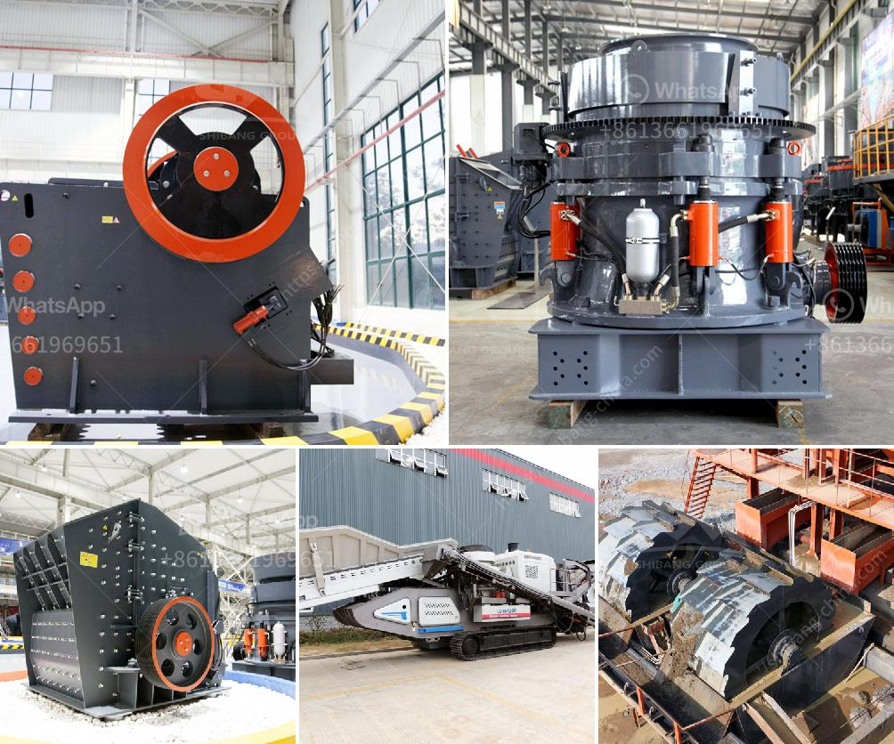

<h3>washing machines detailed diagrams</h3>
The invention of washing machines revolutionized the way we clean our clothes. These machines brought convenience, efficiency, and time-saving capabilities to our daily chores. In this article, we will explore the inner workings of washing machines through detailed diagrams and understand the principles behind their functionality.

A typical washing machine consists of several essential components that work together to deliver exceptional cleaning results. Let us start with the outer casing, which provides structural support and acts as a shield, protecting the inner components from external forces.

Moving on, the control panel located on the top or front of the washing machine allows users to select various modes, adjust settings, and monitor the washing process. It often includes features like temperature control, timer, fabric type selection, and water levels control.

Now, let's delve into the more complex internal mechanisms. The heart of any washing machine is the inner drum or tub, where the clothes are loaded for washing. This drum is typically perforated to allow water and detergent to reach the clothes. The drum can be made of stainless steel or plastic, and it is mounted on a horizontal axis.

Adjacent to the drum is the agitator or paddle system. This component’s purpose is to create a gentle motion within the drum, ensuring the clothes are thoroughly washed. The agitator typically consists of a central spindle and vanes that rotate, moving clothes around during the washing process.

To facilitate water intake and drainage, washing machines possess an inlet valve and a drain pump. The inlet valve, controlled by the control panel, lets water enter the machine to fill the drum. Once the washing cycle is complete, the drain pump expels the used water.

To ensure optimal cleaning, washing machines have a detergent dispenser. This dispenser, often located on the top panel, releases detergent, fabric softener, or bleach into the drum at specific points during the washing cycle. It ensures the right amount of each cleaning agent is applied to achieve desired results.

To facilitate the heating of water when necessary, washing machines often feature a heating element or a washing heater. This heating device warms the water to the required temperature, depending on the selected wash cycle, ensuring effective stain removal and bacteria elimination.

All these components are embedded within an intricate electrical and mechanical system that synchronizes their operation. For instance, when a user selects a particular washing cycle, the control panel sends signals to activate specific components at precise timings. Additionally, sensors, such as water level sensors, temperature sensors, and door sensors, ensure the smooth functioning of the machine during the washing process.

In conclusion, washing machines have become indispensable in our daily lives. Understanding the detailed diagrams of their inner workings enables us to appreciate the engineering marvel behind their efficiency and effectiveness. From the outer casing to the drum, agitator, inlet valve, drain pump, detergent dispenser, and heating elements, each component plays a crucial role in delivering clean and fresh clothes. So, the next time you load your clothes into the washing machine, take a moment to appreciate the intricate mechanisms that make our lives easier.
<h3>Contact us</h3><ul><li><strong>Whatsapp:&nbsp;<a href="https://wa.me/8613661969651">+8613661969651</a></strong></li><li><a href="https://swt.shibang-china.com/?git&amp;zhl&amp;washing machines detailed diagrams"><strong>Online Service(chat now)</strong></a></li></ul><h3>Related</h3><ul><li><a href='rock crusher zenith.md'>rock crusher zenith</a></li><li><a href='mobile stone crushing machine for sale.md'>mobile stone crushing machine for sale</a></li><li><a href='conveyor belts in peru.md'>conveyor belts in peru</a></li><li><a href='700t h mobile crusher.md'>700t h mobile crusher</a></li><li><a href='iron ore concentrate plant tpa production.md'>iron ore concentrate plant tpa production</a></li></ul>