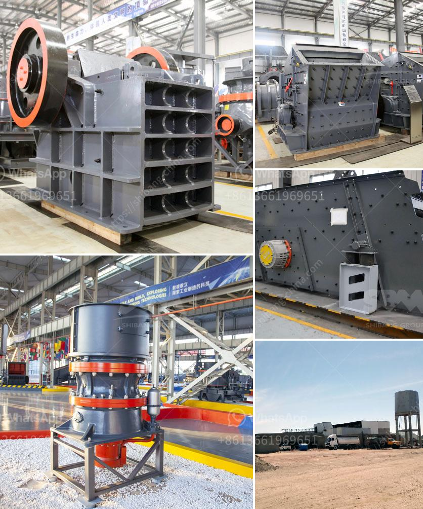

<h3>wet ball milling process</h3>
Wet ball milling is a widely used process in the preparation of various materials such as minerals, ores, coal, carbon, ceramics, paints, and metal alloys. Like most of the materials processing techniques, it is crucial to adjust the parameters of the milling process to achieve the desired characteristics of the final product.

Among the factors that affect the efficiency of a wet ball milling process, the amount of solid, the viscosity of the liquid, and the concentration of the additives are significant. The proper selection and adjustment of these parameters can significantly improve the grinding efficiency and reduce the energy consumption.

In a wet ball milling process, the size of the particles will decrease due to the grinding mechanism between the moving balls and the material in the mill. By adjusting the solid content and the viscosity of the slurry, the grinding process can be controlled to obtain the desired particle size and distribution.

The solid content of the slurry refers to the percentage of solid particles in the liquid medium. In wet ball milling, the solid content can vary from as low as 20% to as high as 70%. When the solid content is too low, the balls may not efficiently collide with the particles, leading to insufficient grinding. On the other hand, when the solid content is too high, the viscosity of the slurry increases, and the balls may agglomerate, reducing the grinding efficiency. It is essential to find the optimal solid content to achieve the desired grinding efficiency.

The viscosity of the liquid medium also plays a crucial role in the wet ball milling process. The viscosity affects the movement of the balls and the dispersion of the particles. High viscosity leads to a lower grinding efficiency as the balls move slower, and the particles tend to agglomerate. Conversely, low viscosity can lead to a higher grinding efficiency by reducing the agglomeration of particles. The viscosity can be controlled by adjusting the liquid medium and adding appropriate additives.

Additives are often used in wet ball milling to improve the grinding efficiency and control the particle size distribution. These additives can act as dispersants, stabilizers, or flow modifiers. Dispersants help to separate the particles and reduce agglomeration, allowing for more efficient grinding. Stabilizers prevent the particles from re-agglomerating after separation. Flow modifiers can improve the flowability of the slurry, enhancing the efficiency of the grinding process. The concentration and types of additives depend on the specific requirements of the milling process.

In conclusion, wet ball milling is a versatile and efficient method for the preparation of various materials. By adjusting the parameters of the milling process, such as the solid content, viscosity, and concentration of additives, the grinding efficiency and the particle size distribution can be controlled. The optimization of these parameters is crucial to achieving the desired characteristics of the final product. Wet ball milling provides a cost-effective and environmentally friendly method for materials processing and holds great potential in various industries.
<h3>Contact us</h3><ul><li><strong>Whatsapp:&nbsp;<a href="https://wa.me/8613661969651">+8613661969651</a></strong></li><li><a href="https://swt.shibang-china.com/?git&amp;zhl&amp;wet ball milling process"><strong>Online Service(chat now)</strong></a></li></ul><h3>Related</h3><ul><li><a href='gold mining equipment manufacturers in china.md'>gold mining equipment manufacturers in china</a></li><li><a href='stone crusher machine price list in kenya.md'>stone crusher machine price list in kenya</a></li><li><a href='difference betweren jaw crusher and impact crusher.md'>difference betweren jaw crusher and impact crusher</a></li><li><a href='crusher manufacturer in.md'>crusher manufacturer in</a></li><li><a href='granite quarrying process.md'>granite quarrying process</a></li></ul>