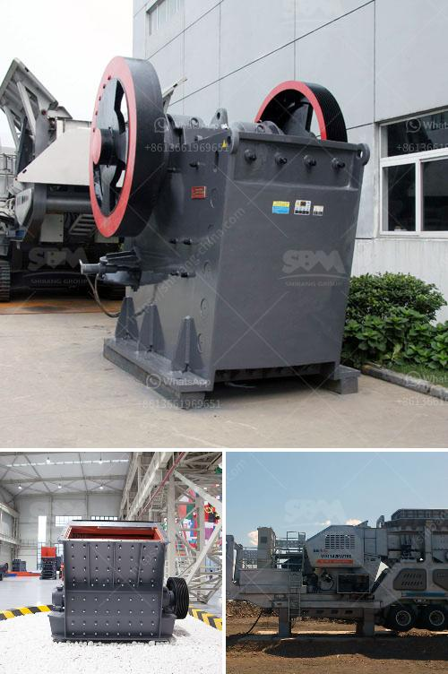

<h3>wet ball mills manufacturers</h3>
Wet ball mill is a kind of equipment that grinds materials into fine powder by tumbling them in liquid. The wet ball mill is widely used to grind various ores and other materials in mining, building materials, chemical industries, etc. It can be divided into two types: wet ball mill and dry ball mill.

In the past, wet ball mill manufacturer mainly focused on the production of domestic equipment. However, with the rapid development of industrial economy, the demand for wet ball mills is increasing, which drives many manufacturers to further expand their production scale and improve the quality of their products.

Nowadays, there are many wet ball mill manufacturers that have emerged domestically and abroad. These manufacturers provide a wide range of wet ball mills with different specifications and functions to meet the needs of customers. They have advanced production equipment, strict quality control systems, and professional technical teams, ensuring the high-quality and reliable performance of their products.

One of the advantages of wet ball mills is their ability to grind materials into very fine powder, which is essential in various industries. Another advantage is their versatility, as they can be used for both wet and dry grinding. This flexibility allows manufacturers to meet the specific requirements of different customers in various industries.

In summary, wet ball mills are widely used equipment in various industries, and the demand for them is increasing. With the continuous improvement of manufacturing techniques and the fierce market competition, wet ball mill manufacturers are striving to provide high-quality products that meet the needs of customers. It is important for customers to choose a reliable and reputable manufacturer to ensure the quality and performance of the wet ball mill they purchase.
<h3>Contact us</h3><ul><li><strong>Whatsapp:&nbsp;<a href="https://wa.me/8613661969651">+8613661969651</a></strong></li><li><a href="https://swt.shibang-china.com/?git&amp;zhl&amp;wet ball mills manufacturers"><strong>Online Service(chat now)</strong></a></li></ul><h3>Related</h3><ul><li><a href='crushers for phonolite.md'>crushers for phonolite</a></li><li><a href='mini concrete crusher portable for rent.md'>mini concrete crusher portable for rent</a></li><li><a href='mobile gold refinery for sale.md'>mobile gold refinery for sale</a></li><li><a href='puzzolana 200 tph stage aggregate crushing.md'>puzzolana 200 tph stage aggregate crushing</a></li><li><a href='superfine grinding mills in shanhgai.md'>superfine grinding mills in shanhgai</a></li></ul>