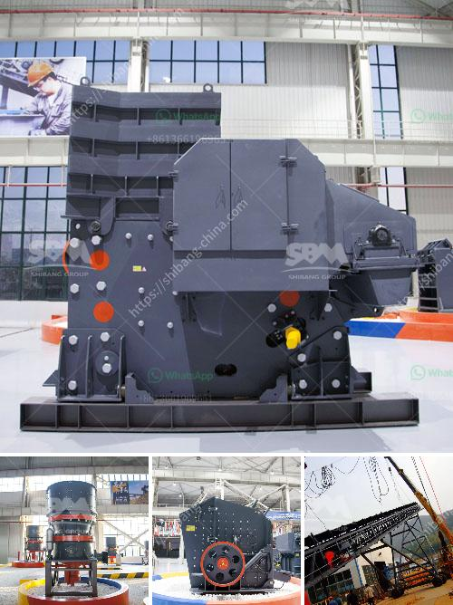

<h3>wet grinder price in nigeria</h3>
The wet grinder is an essential appliance in every kitchen. It reduces the time and effort involved in grinding spices and other ingredients such as lentils and rice. Wet grinders are particularly popular in South Indian cuisine, where they are used to make batter for idlis, dosas, and vadas.

In Nigeria, wet grinders have gained immense popularity due to the increasing number of people exploring South Indian and other regional cuisines. As a result, wet grinder prices in Nigeria have become a crucial factor when purchasing this appliance.

The prices of wet grinders in Nigeria vary depending on the brand, capacity, and additional features. On average, a basic wet grinder will cost around N10,000 to N15,000. However, highly advanced models with advanced features like timers and digital displays can cost up to N35,000 or more.

One of the most popular brands of wet grinders in Nigeria is Butterfly. They offer a wide range of models with different capacities and features. The Butterfly Rhino Plus wet grinder, with a capacity of 2 liters, is available at an average price of N18,000. This model comes with a powerful 150-watt motor and two grinding stones for efficient grinding.

Another well-known brand is Preethi. They offer high-quality wet grinders that are known for their durability and performance. The Preethi Iconic WG 908 2-liter wet grinder is priced at around N27,000 and is equipped with a powerful 150-watt motor and a unique 3D grinding stone.

Prestige is another reliable brand that offers a range of wet grinders in Nigeria. The Prestige PWG 09 2-liter wet grinder is priced at approximately N25,000 and features a high-quality ABS body and a powerful 200-watt motor. This model also comes with a coconut scraper and an atta kneader, making it a versatile option for different cooking needs.

Apart from these brands, there are several other options available in the Nigerian market. It is essential to consider factors like warranty, after-sales service, and customer reviews before making a purchase. Additionally, checking for any ongoing discounts or offers can help you get a wet grinder at a more affordable price.

The price of wet grinders in Nigeria may seem slightly higher compared to other countries due to import and shipping costs. However, investing in a high-quality wet grinder can be a wise decision in the long run, as it ensures efficient grinding and durability.

In conclusion, wet grinder prices in Nigeria range from N10,000 to N35,000 or more, depending on the brand and features. Brands like Butterfly, Preethi, and Prestige offer reliable options with different capacities and additional attachments. It is crucial to consider factors like warranty, after-sales service, and customer reviews before making a purchase decision. By investing in a good quality wet grinder, you can enhance your culinary experience and make delicious South Indian dishes with ease.
<h3>Contact us</h3><ul><li><strong>Whatsapp:&nbsp;<a href="https://wa.me/8613661969651">+8613661969651</a></strong></li><li><a href="https://swt.shibang-china.com/?git&amp;zhl&amp;wet grinder price in nigeria"><strong>Online Service(chat now)</strong></a></li></ul><h3>Related</h3><ul><li><a href='ton per day crusher barmac.md'>ton per day crusher barmac</a></li><li><a href='coal seal of coal pulverizer.md'>coal seal of coal pulverizer</a></li><li><a href='stone to sand crusher.md'>stone to sand crusher</a></li><li><a href='ball mill manufacture in chennai.md'>ball mill manufacture in chennai</a></li><li><a href='process of making quartz marble crusher.md'>process of making quartz marble crusher</a></li></ul>