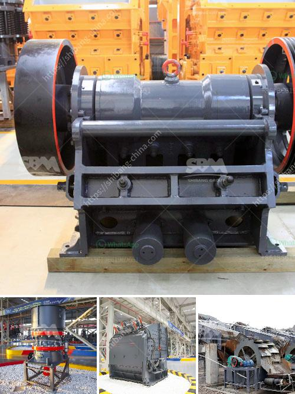

<h3>white cement manufacturing process pdf</h3>
White cement is a specialized form of cement that is used for decorative purposes. It is distinct from regular gray Portland cement in its color, as well as its composition and manufacturing process. This article delves into the process of manufacturing white cement.

The manufacturing process of white cement is quite different from that of regular gray cement. It is made from raw materials with low iron content, such as limestone and kaolin clay. White cement is characterized by its pure white color, which is why it is preferred for decorative purposes, especially in architecture and interiors.

The production of white cement starts with the quarrying of limestone, which is then crushed and blended in precise proportions with other raw materials, including kaolin clay, iron ore, and gypsum. These ingredients are finely ground to form a homogeneous powder.

To ensure the purity of the white cement, great care is taken during the manufacturing process. The temperature in the kiln is carefully controlled to prevent the formation of typical gray cement compounds, such as belite and aluminate phases, which would result in a grayish tint. The raw materials are heated in the kiln at temperatures around 1450 degrees Celsius, resulting in a clinker that is white in color.

After the clinker is cooled, it is mixed with a small amount of gypsum to regulate the setting time. This mixture is then ground into a fine powder in a ball mill, where it undergoes further grinding to achieve the desired fineness. The product obtained from the ball mill is stored in silos or packed into bags before it is ready for use.

White cement is used in various applications, such as decorative architectural elements, terrazzo flooring, tile grouts, and in the production of white concrete. It provides a smooth, clean, and bright finish, making it desirable for aesthetic purposes. Its versatility allows it to be mixed with pigments to create a wide range of colors, expanding its use in different design styles.

The production of white cement requires careful attention to detail at every stage of the manufacturing process. The raw materials must be meticulously selected and blended to ensure the absence of impurities that could affect the final color. The control of temperature during the kilning process is critical to achieving the desired pure white color.

In conclusion, the manufacturing process of white cement involves several steps to ensure the purity and distinctive color. From the selection of raw materials to the precise control of temperature during kilning, every aspect contributes to obtaining a product that is superior in appearance. White cement has gained popularity in the construction industry for its aesthetic qualities, making it a preferred choice for architects, interior designers, and homeowners looking for a clean, bright, and decorative finish.
<h3>Contact us</h3><ul><li><strong>Whatsapp:&nbsp;<a href="https://wa.me/8613661969651">+8613661969651</a></strong></li><li><a href="https://swt.shibang-china.com/?git&amp;zhl&amp;white cement manufacturing process pdf"><strong>Online Service(chat now)</strong></a></li></ul><h3>Related</h3><ul><li><a href='used stone crushing equipment in assam.md'>used stone crushing equipment in assam</a></li><li><a href='stone crusher machine plant for sale in pakistan.md'>stone crusher machine plant for sale in pakistan</a></li><li><a href='stone crusher baler.md'>stone crusher baler</a></li><li><a href='gold mining company tanzania.md'>gold mining company tanzania</a></li><li><a href='price of ballast crusher machine in kenya.md'>price of ballast crusher machine in kenya</a></li></ul>