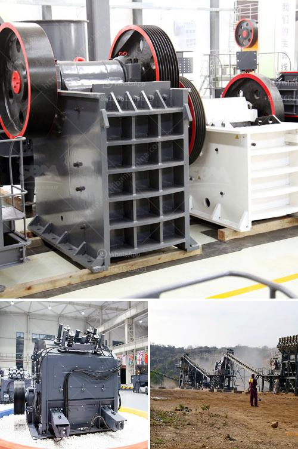

<h3>with conveyor price philippines</h3>
Conveyor systems have become an essential part of industries across the globe. These systems are designed to efficiently transport various goods and materials from one point to another, saving time, effort, and costs. In the Philippines, the demand for conveyor systems has been steadily increasing, as industries recognize their numerous benefits.

When considering purchasing a conveyor system in the Philippines, one of the crucial aspects to consider is the price. The cost of a conveyor system can vary depending on various factors, including the type of conveyor, its length, capacity, and additional features.

Conveyor systems in the Philippines are available in a wide range of types, including belt conveyors, roller conveyors, and chain conveyors, among others. Each type has its specific features and benefits, making them suitable for different applications. Belt conveyors, for example, are commonly used in airports, warehouses, and manufacturing facilities due to their ability to handle both light and heavy materials.

The price of a conveyor system in the Philippines primarily depends on its length and capacity. Longer conveyors typically come with higher price tags, as they require more materials and labor for installation. Similarly, conveyors with higher capacity, which can handle larger volumes of materials, tend to be more expensive. However, it is essential to carefully evaluate your business's needs to determine the appropriate length and capacity, ensuring that you get the most value for your investment.

Additional features can also impact the price of a conveyor system in the Philippines. These features may include speed control, adjustable height, and automatic sorting capabilities. While these added functionalities increase the cost, they can significantly enhance the efficiency and productivity of your operations. Therefore, it is crucial to weigh the benefits against the price when considering these features.

It is also worth noting that the price of a conveyor system in the Philippines can vary across different suppliers and manufacturers. It is essential to do thorough research and compare prices from multiple sources to ensure that you are getting the best deal. Consider factors such as the reputation and reliability of the supplier, as well as the quality and durability of their products.

Investing in a conveyor system in the Philippines can bring numerous advantages to your business. It can streamline your operations, increase productivity, reduce labor costs, and improve overall efficiency. However, it is crucial to carefully consider the price of the conveyor system to ensure that it aligns with your budget and provides a satisfactory return on investment.

In conclusion, when looking for conveyor systems in the Philippines, it is essential to consider the price along with other important factors such as type, length, capacity, and additional features. By carefully evaluating your business's needs and comparing prices from different suppliers, you can make an informed decision and invest in a conveyor system that optimizes your operations, boosts productivity, and delivers long-term value.
<h3>Contact us</h3><ul><li><strong>Whatsapp:&nbsp;<a href="https://wa.me/8613661969651">+8613661969651</a></strong></li><li><a href="https://swt.shibang-china.com/?git&amp;zhl&amp;with conveyor price philippines"><strong>Online Service(chat now)</strong></a></li></ul><h3>Related</h3><ul><li><a href='quartz crushing project report.md'>quartz crushing project report</a></li><li><a href='production quarzt sand machine.md'>production quarzt sand machine</a></li><li><a href='gold washing equipment portable.md'>gold washing equipment portable</a></li><li><a href='roller mill for sale kenya.md'>roller mill for sale kenya</a></li><li><a href='list of limestone mining companies in china.md'>list of limestone mining companies in china</a></li></ul>