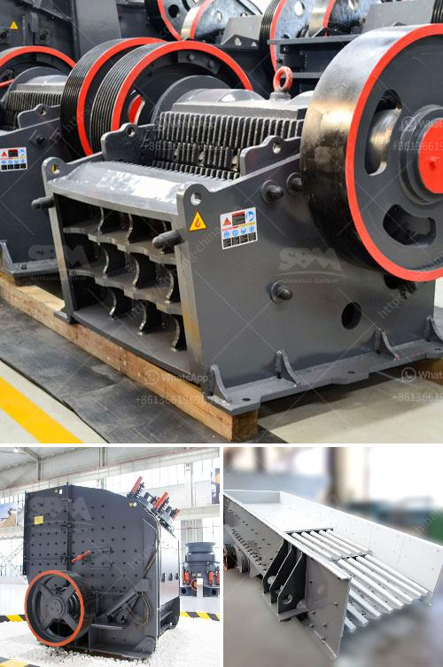

<h3>works cement grinding ball mill</h3>
Cement grinding ball mill is a key equipment to grind the crushed materials, and the ball mill is widely used in powder-making production line including cement, silicate, new-type building material, refractory material, fertilizer, ore dressing of ferrous metal and non-ferrous metal, glass ceramics, etc. And the ball mill can grind various ores and other materials with dry type and wet type.

The cement grinding ball mill is a horizontal rotating device transmitted by the outer gear. The materials are transferred to the grinding chamber through the quill shaft uniformly. There are ladder liners and ripple liners and different specifications of steel balls in the chamber. The centrifugal force caused by rotation of barrel brings the steel balls to a certain height and impact and grind the materials. The ground materials are discharged through the discharging board thus the grinding process is finished.

The cement grinding ball mill is energy-saving, wide use, and easy operation. And it is suitable for grinding all kinds of ores and other materials, no matter wet grinding or dry grinding. Besides, it is mainly applied in many industries, such as ferrous&non-ferrous metal mine, coal, traffic, light industry, etc. The wide use of cement grinding ball mill not only reduces the investment cost, but also ensures the rational utilization and comprehensive recovery of resources. It has played a significant role in promoting the sustainable development of the cement industry.

In summary, the cement grinding ball mill is a highly efficient grinding machine that can grind various materials into fine powder. The cement mill is used to grind and dry various ores and other materials, and plays an important role in the beneficiation process. As the key equipment in the cement production line, it consumes large amounts of energy and contributes to environmental pollution. Therefore, it is necessary to take measures to reduce energy consumption and improve efficiency in the operation of cement grinding ball mills.
<h3>Contact us</h3><ul><li><strong>Whatsapp:&nbsp;<a href="https://wa.me/8613661969651">+8613661969651</a></strong></li><li><a href="https://swt.shibang-china.com/?git&amp;zhl&amp;works cement grinding ball mill"><strong>Online Service(chat now)</strong></a></li></ul><h3>Related</h3><ul><li><a href='price of stone crushers in malaysia.md'>price of stone crushers in malaysia</a></li><li><a href='iron crushing equipment cost.md'>iron crushing equipment cost</a></li><li><a href='mobile crushers for sale uk.md'>mobile crushers for sale uk</a></li><li><a href='concrete crushing machine cost.md'>concrete crushing machine cost</a></li><li><a href='grinding size of bentonite crusher.md'>grinding size of bentonite crusher</a></li></ul>