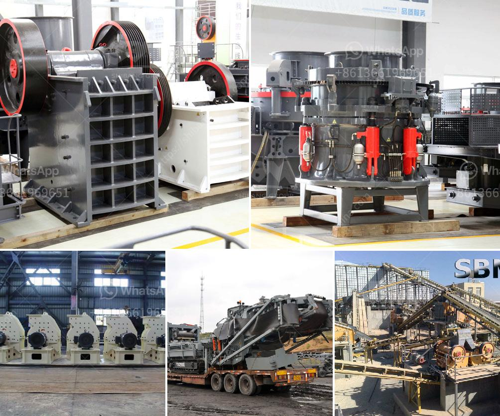

<h3>zirconia powder ball mill plant</h3>
Zirconia powder, also known as zirconium oxide, is a highly versatile material used for a wide range of applications. It is a ceramic material with superior strength, hardness, and resistance to wear and corrosion. Zirconia is commonly used in industries such as medical, dental, electronics, and automotive.

To produce zirconia powder, a ball mill plant is required. A ball mill is a grinding machine used to grind, blend, and sometimes mix materials used in various industries. The ball mill uses a cylindrical container that rotates on its axis. This container is filled with the zirconia powder and a suitable grinding medium, such as ceramic balls.

The ball mill plant for zirconia powder production consists of several components. Firstly, the feeder delivers the raw materials into the ball mill. The grinding medium inside the mill crushes and grinds the powdered zirconia into finer particles. The ground powder is then released from the machine through the discharge port.

A ball mill plant for zirconia powder production can vary in its capacity, depending on the needs of the manufacturer. Plants can be designed to produce anywhere from 100 to 300 kilograms of zirconia powder per hour. These plants are typically automated to ensure efficiency and consistency in the production process.

The advantages of using a ball mill plant for zirconia powder production are numerous. Firstly, the process is cost-effective, offering manufacturers a cost-efficient method to produce high-quality zirconia powder. Secondly, the ball mill plant allows for precise control over the particle size of the zirconia powder, ensuring consistency in the final product.

In conclusion, zirconia powder ball mill plants are essential for the production of zirconia powder in various industries. These plants provide an efficient and cost-effective method to produce high-quality zirconia powder with controlled particle sizes. With the increasing demand for zirconia in various applications, the importance of ball mill plants in the manufacturing process cannot be overstated.
<h3>Contact us</h3><ul><li><strong>Whatsapp:&nbsp;<a href="https://wa.me/8613661969651">+8613661969651</a></strong></li><li><a href="https://swt.shibang-china.com/?git&amp;zhl&amp;zirconia powder ball mill plant"><strong>Online Service(chat now)</strong></a></li></ul><h3>Related</h3><ul><li><a href='hydraulic cone crusher application.md'>hydraulic cone crusher application</a></li><li><a href='calcium carbonate powder making equipment in germany.md'>calcium carbonate powder making equipment in germany</a></li><li><a href='vertical mill for slag grinding.md'>vertical mill for slag grinding</a></li><li><a href='crushing and screening plant rental.md'>crushing and screening plant rental</a></li><li><a href='coal mill pulverizer in thermal power plant.md'>coal mill pulverizer in thermal power plant</a></li></ul>